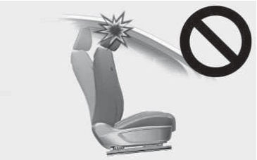
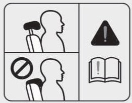
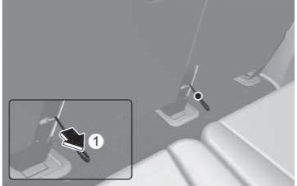
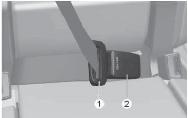
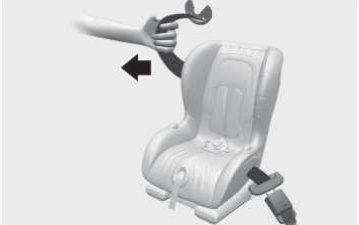
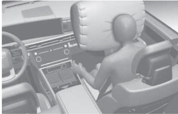
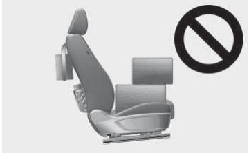
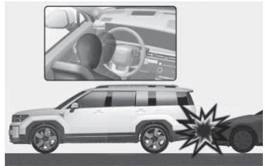

# 3. 시트 및 안전 장치

좌석 ····· 34
앞좌석 .............................. ··· ···· ··· ························· 40
뒷좌석 ······ 55
열선 시트 ·············· 71
앞좌석 열선 시트 사용 ················· 71
뒷좌석 열선 시트 사용 ---------------- 72
통풍 시트 ·············· ····· ・・・・・・・・・ 74
앞좌석 통풍 시트 사용 ··················································· ・・・・・・・・・・・・・・・・・・ ······················ 74
안전벨트 ・・・・・・・・・・・ ················· 75
안전벨트 구속 장치 --------------------------- ・・・・・・・・・・ ・・・・・・・・・ ・・・・・・・・・・ ·· ····················· 75
안전벨트 프리텐셔너 ・・・・・・・・・ ·················· 82
안전벨트 사용 시 유의 사항 ················· ··················· 83
안전벨트의 적절한 관리 ················ ················ 84
어린이 보호용 장치 (보조 좌석).................. ················· 85
어린이 보호용 장치의 장착..................... ·················· 85
에어백 (보조 구속 장치) ···················· ············ 91
에어백 관련 부품 ······················· ················· 92
에어백 경고등 ---------------- .... ··························· 94
에어백 장치의 구성 및 기능 ······················ 95
안전벨트 착용의 중요성 ················ ················· 96
운전석 에어백/무릎 에어백 ················ ·················· 97
동승석 에어백 ・・・・・・・・ ················· 98
승객 구분 시스템 103)------- 99
사이드 에어백 ---------- ・・・・・・・・・・・・・・・・・ .......................... 106
커튼 에어백 ·························· ··················· ···· ・・・・・・・ ···· ······················· 108
에어백의 작동/비작동 조건 ··························· 109
에어백 정비 ························· 115
에어백 경고 라벨 ···· ·················· 116

# 시트 및 안전 장치

# 좌석

1
2
10
3
B
8
8

본 도안은 적용된 사양에 따라 실제 차량과 다를 수 있습니다.

# 운전석[A]

- 1: 전후 위치 조절
- 2: 등받이 각도 조절
- 3: 좌석 높낮이 조절
- 4: 쿠션 각도 조절(사양 적용 시)
- 5: 허리 지지대(럼버 서포트) 조절(사양 적용 시)
- 6: 시트 볼스터 조절
- 7: 릴렉션 컴포트 시트 스위치(사양 적용 시)
- 8: 다리 받침대 조절 스위치(전·후 조절)
- 9: 쿠션 지지 조절 스위치(상·하 조절)(사양 적용 시)
- 10: 헤드레스트 조절

# 동승석[B], [C]

1: 전후 위치 조절
34

3

- 2: 등받이 각도 조절
- 3: 좌석 높낮이 조절(사양 적용 시)
- 4: 쿠션 각도 조절(사양 적용 시)
- 5: 다리 받침대 조절 스위치(사양 적용 시)
- 6: 릴렉션 컴포트 시트 스위치(사양 적용 시)
- 7: 헤드레스트 조절
- 8: 동승석 측면 워크인 스위치(사양 적용 시)

# 운전석[D]

- 1: 에르고 모션
- 2: 운전석 자세 메모리 시스템

| i 알아두기 |
| --- |
| 주행 전 좌석의 위치, 각도, 높낮이 등을 조절하여 올바른 운전 자세가 되도록 하십시오. |

2
3
4
5 2
4
5
1
3ND
2

# 시트 및 안전 장치

# 2열 좌석(5인승, 7인승)[A]

1: 전후 위치 조절
2: 등받이 각도 조절
3: 3열 승하차 스위치(7인승, 사양 적용 시)
4: 헤드레스트 조절
5: 3열 승하차 스위치(7인승, 사양 적용 시)
2열 좌석(6인승)[B]
1: 전후 위치 조절
2: 등받이 각도 조절
3: 쿠션 각도 조절
4: 릴렉션 모드 스위치
5: 슬라이딩 록킹 해제 스위치
6: 헤드레스트 조절
7: 3열 승하차 스위치
2열 좌석 뒤 [C]
1: 3열 승하차 스트랩(비상용)
화물칸[D]
1: 2열 등받이 접힘 스위치(5인승, 7인승)(사양 적용 시)
2: 2열 등받이 접힘/펼침 스위치(6인승)(사양 적용 시)
3열 좌석[E]
1: 등받이 접힘/펼침 스트랩
2: 등받이 각도 조절
3: 헤드레스트 조절

3

# 인포테인먼트 시스템

Q 차량
공조 밀선/통풍 편의
>
앞선/힘을자 분야 기능을 일정합니다.
시트
송하차 편의
중학자 시 사회의 만들 여초의 설립하여 또한철 확보입니다.
라이트
스마트 서포트
도어
+포츠모드 드는 34도로 주민 no. 기능 쉽게 시작종합니다.
디지털키 에르고 모션 시트
입관공학적인 지도 특허물을 숯불하게 미흐 저장, 주방강산맛
페이 만남성공 닭살 시킵니다.
송 三

인포테인먼트 시스템의 설정 > 차량 > 시트를 차례로 선택하십시오. 각종 편의 기능을 사용할 수
있습니다.

# · 열선/통풍 편의

- - 공조 연동 자동 제어: 히터 및 에어컨 시스템과 연동하여 스티어링 휠 열선 및 운전석 열선 시
- 트/통풍 시트를 자동으로 제어합니다.

- · 승하차 편의: 운전석, 동승석(사양 적용 시) 또는 스티어링 휠의 이동 여부를 설정할 수 있습니
- 다. 자세한 내용은 5장 내 '운전석 자세 메모리 시스템'을 참고하십시오.
- · 시트 스위치 알림: 시트 스위치 조작 및 위치 변경 정보가 시트 이미지와 함께 표시됩니다.
- · 스마트 서포트: 스포츠 모드 또는 고속 주행 시 시트 볼스터 지지가 높아집니다.
- · 에르고 모션 시트

- - 컴포트 스트레칭: 컴포트 스트레칭 기능의 세기 및 작동 시간을 선택할 수 있습니다.
- - 자세 보조: 1시간 주행 후 자동으로 운전석의 엉덩이와 허리 부분을 조절하여 운전자의 자세
- 를 보조해줍니다.
- - 주행 중 허리 보호 기능: 오랜 시간 연속해서 주행할 경우 일정한 패턴으로 럼버 서포트를 반
- 복 작동합니다.

# i 알아두기

- · 인포테인먼트 시스템에 표시되는 내용은 차량의 사양 구성에 따라 해당 메뉴가 없거나 이 취급
- 설명서와 다르게 나타날 수 있습니다.
- · 인포테인먼트 시스템은 업데이트로 변경될 수 있습니다. 자세한 내용은 인포테인먼트 시스템
- 또는 간편 설명서의 웹 매뉴얼을 참고하십시오.

# 시트 및 안전 장치

# ! 경고

- · 좌석 밑 또는 좌석과 중앙 콘솔 박스의 틈새로 들어간 작은 물건(라이터, 동전, 신용카드 등)을
- 꺼내기 위해 손을 넣으면 좌석 기계 장치의 모서리 등 날카로운 부분에 의해 손을 다칠 수 있습
- 니다.
- · 좌석 밑 공간에 물건을 두지 마십시오. 차량 주행 환경에 따라 물건이 움직이면서 좌석과 부딪
- 히거나, 좌석 밑에서 빠져나와 승객에게 부상을 입힐 수 있습니다.
- · 운전석 아래에 물건을 두지 마십시오. 브레이크 또는 가속 페달을 밟을 때 물건이 움직이면서
- 페달 조작에 방해를 일으켜 심각한 사고가 날 수 있습니다.
- · 운전자의 발 근처에 물건이 있으면, 브레이크 또는 가속 페달을 밟을 때 물건이 움직이면서 방
- 해를 주어 심각한 사고가 날 수 있습니다.
- · 어린이 혼자 차 안에 남겨 두지 마십시오. 예기치 못한 사고가 날 수 있습니다.
- · 주행 중에는 절대로 좌석을 조절하지 마십시오. 주행 중에 좌석을 조절하면 운전에 방해가 되
- 고, 사고로 인하여 심하게 다치거나 사망할 수 있습니다.
- · 조절 후에는 좌석이 확실히 고정되어 있는지 확인하십시오.
- · 좌석을 조절할 때는 뒷좌석 탑승자에 유의하십시오.
- · 안전벨트는 똑바로 앉은 자세에서 어깨띠가 가슴을 지나고, 골반띠가 골반을 지나도록 착용하
- 십시오.
- · 좌석 각도를 조절할 때 방해되는 물건을 제거해 등받이가 정상적인 위치에 있도록 하십시오.
- 급정차나 충돌 사고 시 심하게 다치거나 사망할 수 있습니다.
- · 좌석을 조절할 때 레일 부분이나 좌석 고정 장치에 부딪혀 다치지 않도록 조심하십시오. 특히
- 어린이나 유아들이 다치지 않도록 주의하십시오. 항상 등받이를 똑바로 세우고 정상적인 위치
- 에서 주행하십시오.
- · 주행 중에 좌석을 접은 채로 앉지 마십시오.
- 충돌할 때 안전벨트가 제 기능을 하지 못하여 크게 다칠 수 있습니다.
- · 운전자는 운전에 방해되지 않는 범위에서 스티어링 휠로부터 가능한 떨어져 앉아야 합니다. 스
- 티어링 휠과 너무 가까우면 에어백이 작동할 때 치명적인 부상을 입을 수 있습니다.
- · 라이터를 바닥이나 좌석 사이에 놓지 마십시오. 좌석을 움직일 때 가스가 분출되는 경우 화재의
- 위험이 있습니다.
- · 방석을 사용할 경우 탑승자와 좌석의 마찰력이 줄어들어 충돌이나 급정차 시 엉덩이가 안전벨
- 트의 아랫부분으로 미끄러질 수 있습니다. 이럴 경우 안전벨트가 정상적인 기능을 하지 못해 심
- 각한 부상을 입을 수 있습니다.
- · 좌석 조절 시 좌석 밑이나 작동 부위에 손을 넣지 마십시오. 손가락 또는 손이 끼어 다칠 수 있습
- 니다.
- 주행 중 좌석 등받이를 항상 세우고 앉으십시오. 등받이를 지나치게 젖히고 앉으면 충돌 또는
- 급정차할 때 몸이 안전벨트 아래로 빠져나가면서 복부나 목이 조여 심하게 다치거나 사망할 수
- 있습니다.

3

# 시트 및 안전 장치

# ! 주의

프라임 나파 가죽(사양 적용 시)은 가죽 고유의 질감을 최대한 살린 특성으로 인해 다음의 현상
이 발생할 수 있습니다.

- - 표면에 모공, 상처, 혈관 자국 등이 남아 있음
- - 사용 시 눌린 자국, 주름이 생김
- - 햇빛이나 열에 지속해서 노출되면 색상이 변형됨

- · 가죽이 물기에 젖었다면 마른 천으로 물기를 제거하고 그늘에 건조하십시오.
- · 가죽 표면에 스크래치가 날 수 있으니 날카로운 물체와 마찰하지 않도록 주의하십시오.
- · 밝은 색상의 가죽은 오염이나 이염에 주의하십시오.

# 앞좌석

# 수동식(동승석)

# 전후 위치 조절하기

- 1 좌석 쿠션의 앞쪽 레버를 당긴 채 좌석을 원하는 앞·뒤 위치로 조절하십시오.
- 2 조절 레버를 놓으면 고정됩니다.
- 3 좌석을 가볍게 흔들어 확실하게 고정됐는지 확인하십시오.

# 등받이 각도 조절하기

3

- 1 좌석에 앉아 등을 약간 앞으로 숙인 상태에서 좌석 바깥쪽에 위치한 좌석 각도 조절 레버를 위
- 로 당기십시오.
- 2 조심해서 좌석에 기대어 원하는 위치로 조절하십시오.
- 3 조절 레버를 놓으면 고정됩니다.
- 4 등받이가 확실하게 고정됐는지 확인하십시오.

전동식
사양 적용시

주의

!

- · 전동식 좌석 조절 장치는 시동을 꺼도 작동하기 때문에 어린이가 잘못 만지면 사고로 이어질 수
- 있습니다. 안전을 위해 어린이를 차 안에 혼자 두지 마십시오.
- · 조절 장치는 모터로 작동됩니다. 조절이 끝나면 스위치에서 손을 떼십시오. 과도한 조작은 모터
- 의 전기 장치에 손상을 입힐 수 있습니다.
- · 전동식 좌석 조절 장치는 많은 양의 전기동력이 필요합니다. 배터리가 방전되지 않도록 시동이
- 꺼진 상태에서는 되도록 사용을 자제하십시오.
- · 동시에 두 개 이상의 스위치를 조작하지 마십시오. 모터 및 전기 장치가 손상될 수 있습니다.

# 전후 위치 조절하기

조절 스위치를 앞·뒤로 밀거나 당겨 위치를 조절하십시오.

# 등받이 각도 조절하기

# 시트 및 안전 장치

등받이 각도 조절 스위치 윗부분을 앞으로 당기면 등받이가 앞으로 숙여지고, 뒤로 밀면 등받이가
뒤로 젖혀집니다.

# 쿠션 각도/높낮이 조절하기

2
2

- · 쿠션 각도 조절(1)
- 조절 스위치의 앞쪽을 올리거나 내리면 쿠션의 앞부분이 올라가거나 내려옵니다.
- · 좌석 높낮이 조절(2)
- 조절 스위치의 뒤쪽을 올리거나 내리면 좌석 전체가 올라가거나 내려옵니다.

# 허리 지지대(럼버 서포트) 조절하기

# 사양 적용시

A타입

1 2

3

B타입

4
1 2 3

- · 허리 지지대 전후 조절하기(A타입)
- 허리 받침대 조절 스위치의 앞부분(1)을 누르면 운전석 등받이 허리 지지 부분이 앞으로 튀어나
- 오고, 스위치의 뒷부분(2)을 누르면 허리 지지 부분이 뒤로 들어갑니다.
- · 허리 지지대 전후/상하 조절하기(운전석)(사양 적용 시)(B타입)

- - 허리 지지대 조절 스위치의 앞부분(1)을 누르면 운전석 등받이 허리 지지 부분이 앞으로 튀
- 어나오고, 스위치의 뒷부분(2)을 누르면 허리 지지 부분이 뒤로 들어갑니다.
- - 허리 지지 부분의 상하 위치를 변경하려면 스위치의 윗부분(3)이나 아랫부분(4)을 누르십시
- 오.

# ! 주의

- · 허리 지지대 부분이 날카로운 물건으로 인해 손상되지 않도록 주의하십시오.
- · 허리 지지대가 더 이상 튀어 나오지 않는다면 작동을 멈추십시오. 허리 지지대 작동 모터가 손
- 상될 수 있습니다.

# 시트 볼스터 조절하기 (운전석)

사양 적용시

조절 스위치를 앞으로 당기거나 뒤로 밀면 시트 볼스터(Bolster)의 지지가 높아지거나 낮아집니
다.

# 시트 및 안전 장치

다리 받침대 조절하기
사양 적용시

3
1
2

편히 휴식할 때 다리를 받침대에 올려놓고 각도를 조절하십시오.

- · 스위치 뒷부분을 앞(1)으로 밀면 다리 받침대가 올라갑니다.
- · 스위치 앞부분을 뒤(2)로 밀면 다리 받침대가 내려갑니다.
- · 스위치 아랫부분을 위(3)로 올리면 쿠션 지지 부분이 위로 올라갑니다.
- · 스위치 윗부분을 아래(4)로 누르면 쿠션 지지 부분이 아래로 내려갑니다.

경고

!

- · 다리 받침대를 올리거나 내릴 때 앞좌석 시트 밑이나 근처 구조물에 발이나 손이 끼지 않도록
- 주의하십시오. 예기치 못한 상해가 발생할 수 있습니다.
- · 어린이가 스위치를 조작하지 못하도록 주의하십시오. 어린이가 스위치를 조작하면 예기치 못한
- 상해가 발생할 수 있습니다.

주의

!

다리 받침대 끝에 앉거나 무거운 물건을 올려 놓지 마십시오. 다리 받침대 구동 장치가 손상될 수
있습니다.

# 알아두기

# i

다리 받침대를 사용하기 전에, 좌석을 뒤로 이동하십시오. 좌석이 주변 부품과 가까우면 다리 받침
대 사용이 제한됩니다.

3

# 릴렉션 기능 (릴렉션 컴포트 시트)
사양 적용시

릴렉션 기능은 장시간 동일 자세를 유지할 때 몸에 가해지는 압력과 특정 부위에 집중되는 하중을
분산시킵니다. 또한, 관절의 부담을 줄이고 균형 잡힌 최적의 자세를 제공해 탑승자의 피로와 불편
을 완화합니다.

주의

!

- · 시트를 작동할 때 신체 일부나 물건이 끼이지 않도록 주의하십시오.
- · 주행 중에는 시트를 작동하지 마십시오. 운전자의 주의가 분산되어 사고가 발생할 수 있습니다.
- · 주차 또는 정차 시에 휴식을 취할 때만 시트를 작동하십시오. 주행 중 시트를 작동하다 사고가
- 발생하는 경우 부상 위험이 증가할 수 있습니다.
- · 안전벨트를 착용한 채 시트를 작동하는 경우 안전벨트가 가슴에 밀착되지 않아 부상 위험이 증
- 가할 수 있습니다.

# i 알아두기

다음과 같은 경우에는 운전석 릴렉션 기능을 사용할 수 없습니다.

- · 'P'(주차) 위치로 변속하지 않은 경우
- · 차량이 3 km/h 이상의 속도로 움직이는 경우
- · 운전석 자세 메모리 시스템의 초기화가 필요한 경우

# 시트 및 안전 장치

# 릴렉션 기능 사용하기

동승석 측면 스위치

운전석/동승석 시트 조절 스위치

# 운전석

1 차량을 완전히 정차한 후 'P'(주차)로 변속하십시오.

- 'ON' 또는 시동이 걸린 상태에서 릴렉션 기능 스위치의 뒷부분(1)을 길게 누르십
- 2 시동 'ACC', ,
- 시오.
- · 좌석의 전후 위치, 시트 쿠션 각도, 등받이 각도, 시트 쿠션 높이, 다리 받침대(사양 적용 시)가
- 미리 저장해 둔 릴렉션 컴포트 시트 위치로 변경됩니다.
- · 릴렉션 기능 작동 완료 후 보다 편한 자세를 위해 시트 조절 스위치로 좌석을 조절할 수 있습니
- 다.
- · 쿠션 각도 조절 스위치 앞쪽을 올리면 쿠션이 위(1)로 미세 조정됩니다.

3

· 쿠션 각도 조절 스위치 앞쪽을 내리면 쿠션이 아래(2)로 미세 조정됩니다.

2

- · 등받이 각도 조절 스위치 위쪽을 뒤로 당기면 등받이가 등받이가 뒤(1)로 미세 조절됩니다.
- · 등받이 각도 조절 스위치 위쪽을 앞으로 당기면 등받이가 앞(2)으로 미세 조절됩니다.

2

# i 알아두기

우연한 스위치 눌림 등으로 인해 의도치 않게 릴렉션 기능이 작동하는 경우 시트 조절 스위치를 이
용해 작동을 멈추거나 제어할 수 있습니다.

주의

!

- · 뒷좌석에 탑승자 또는 기타 적재물이 있을 경우 릴렉션 컴포트 시트를 작동하지 마십시오.
- · 뒷좌석이 뒤쪽으로 끝까지 당겨져 있으며, 뒷좌석 등받이가 세워져 있는 경우에만 릴렉션 컴포
- 트 시트를 사용하십시오.

# 릴렉션 기능 해제하기

릴렉션 기능이 작동된 상태에서 릴렉션 기능 스위치의 앞부분(2)을 길게 누르십시오.

- · 운전석: 최근 'P'(주차) 위치 변속 시의 시트 위치로 돌아갑니다.
- · 동승석: 미리 저장된 시트 위치로 돌아갑니다.
- 동승석 복귀 위치 저장하기

# 시트 및 안전 장치

동승석 복귀 위치를 저장하려면 시트를 원하는 위치로 조절한 후 릴렉션 기능 스위치 앞부분(2)
을 3회 연속으로 누르십시오.

# i 알아두기

- · 릴렉션 기능 사용을 중단하고 시트를 원래 위치로 이동할 때에는 릴렉션 기능 스위치만 사용하
- 십시오.
- 다른 시트 조절 스위치로 좌석을 조절하면 시트 쿠션 위치가 아래 방향으로 이동하지 않을 수
- 있습니다.
- · 릴렉션 기능 작동 중에 2열 좌석이 특정 위치로 이동할 수 있습니다.

# 릴렉션 기능 초기화하기

릴렉션 기능이 정상적으로 작동하지 않을 경우 다음과 같이 초기화하십시오.
운전석
운전석 초기화 방법은 5장 내 '운전석 자세 메모리 시스템 초기화'를 참고하십시오.
동승석

1 다음의 스위치를 동시에 약 5초 동안 누르십시오.

- · 등받이 각도 조절 스위치 위쪽을 뒤로 누름(1)
- · 좌석 높낮이 조절 스위치를 아래로 누름(2)
- · 릴렉션 기능 스위치 앞부분 누름(3)

- 2 좌석 전후 위치, 등받이 각도, 쿠션 높낮이, 쿠션 각도가 순서대로 자동 작동합니다.
- 3 모든 작동이 끝나면 초기화가 끝납니다.

단, 동승석 조절 스위치를 눌렀을 때 초기화 진행이 멈춥니다.
뒷좌석 릴렉션 모드 초기화 방법은 '2열 좌석 조절(6인승)'를 참고하십시오.

주의

!

초기화를 진행하기 전에 동승석 주변에 장애물이 없도록 하십시오.

3

# i 알아두기

- · 초기화를 진행하기 전에 동승석 주변에 장애물이 없도록 하십시오.
- · 초기화가 끝나면 동승자에 맞게 좌석을 조절하십시오.

# 에르고 모션 시트 설정하기 (운전석)

+ 사양 적용시

Q 차량
시트위치변경일원
금조 ·· 조치나 장님가그리즈제외적으로쉽게
동시됩니다.
시트
소위를위해거야
라이트
도어
스마트 서포트
디지털키
메르고 모션 시트
하며
인간음악적인 4� 포학도 주변삼성장
三 인천성을 항상 시킵니다.

인포테인먼트 시스템의 설정 > 차량 > 시트 > 에르고 모션 시트를 차례로 선택하십시오. 운전자를
위한 보조 기능을 선택하거나 설정할 수 있습니다.

| ! 경고 |
| --- |
| 주행 중에는 절대로 좌석을 조절하지 마십시오. 주행 중에 좌석을 조절하면 운전에 방해가 되고, 사고 발생 위험이 높아집니다. |

# 컴포트 스트레칭

운전자의 골반과 허리의 피로를 완화하기 위해 시트를 움직일 수 있습니다.

컴포트 스트레칭 버튼을 누를 때마다 아래 순서대로 모드를 변경하거나 기능을 끌 수 있습니다.

- · 골반 스트레칭: 쿠션 부분이 움직여 골반의 좌우 운동을 도와줍니다.
- · 허리 스트레칭: 허리 지지 부분이 움직여 허리의 전후 운동을 도와줍니다.

# 시트 및 안전 장치

- · 전신 스트레칭: 쿠션 및 허리 지지 부분이 순차적으로 움직여 피로 완화를 위한 전신 운동을 합
- 니다.
- · 꺼짐: 컴포트 스트레칭 기능을 종료합니다.

또한, 인포테인먼트 시스템의 설정 메뉴에서 컴포트 시트의 작동 세기 및 작동 시간을 변경할 수
있습니다.

- · 작동 세기: 시트 > 에르고 모션 시트 > 컴포트 스트레칭 > 강한 세기 또는 보통 세기
- · 작동 시간: 시트 > 에르고 모션 시트 > 컴포트 스트레칭 > 작동 시간 > 짧게(10분)/보통(15분)/
- 길게(20분)

# 자세 보조

주행 후 1시간이 지나면 자세 보조 기능이 자동으로 켜져 운전석의 허리와 골반 부분을 조절하여
운전자의 자세를 보조합니다.
기능을 켜려면 인포테인먼트 시스템의 설정 > 차량 > 시트 > 에르고 모션 시트 > 자세 보조를 차
례로 선택하십시오.

# 주행 중 허리 보호 기능

오랜 시간 연속해서 주행할 경우 허리의 피로를 저감시키기 위해 일정한 패턴으로 럼버 서포트를
반복 작동하는 기능입니다. 주행 중 허리 보호 기능은 30분 또는 1시간 동안 연속해서 주행할 경
우 자동으로 작동합니다.
단, 주행 중 허리 보호 기능이 작동 중일 때 럼버 서포트 스위치를 조작하면 기능이 즉시 중지됩니
다.
기능을 켜려면 인포테인먼트 시스템의 설정 > 차량 > 시트 > 에르고 모션 시트 > 주행 중 허리 보
호 > 끄기/30분/1시간을 차례로 선택하십시오.

# 스마트 서포트

# 사양 적용시

통합 주행 모드에서 스포츠 모드를 선택하면 시트 볼스터의 지지가 높아지고, 쿠션 지지 부분이 아
래로 내려갑니다. 이 상태로 고속 주행하면 시트 볼스터의 지지가 더 높아집니다.
기능을 켜려면 인포테인먼트 시스템의 설정 > 차량 > 시트 > 스마트 서포트를 차례로 선택하십시
오.

# 헤드레스트 조절

3

- · 헤드레스트는 안락감을 제공하며 충돌 사고 시 머리와 목을 보호하도록 도와줍니다. 원하는 위
- 치로 조절하여 사용하십시오.
- · 헤드레스트와 머리 사이 거리는 가까울수록 후방 충돌 시 목을 더 잘 보호할 수 있습니다.

# 주의

!

좌석이 앞으로 이동된 상태에서 좌석 등받이를 앞으로 굽히면 헤드레스트가 선바이저 등 주변 부
품을 파손시킬 수 있고, 간섭으로 인해 헤드레스트 작동이 어려울 수 있으니 주의하십시오.

# 전후 위치 조절하기

- · 헤드레스트를 잡고 화살표 방향으로 움직여 조절하십시오.
- · 헤드레스트를 앞방향으로 최대한 이동시키면 자동으로 헤드레스트가 뒷방향으로 원위치됩니다.

# 시트 및 안전 장치

# 높낮이 조절하기

A타입

3
2

B타입

3

헤드레스트의 높이는 헤드레스트의 중심부와 탑승자 귀 윗부분이 일치하도록 조절하십시오.

- · 높일 때는 헤드레스트를 잡고 잠기는 위치까지 위로 당겨 올리십시오(1).
- · 내릴 때는 잠금 해제 버튼(2)을 누른 상태에서 헤드레스트를 아래로 누르십시오(3).

# 헤드레스트 분리하기

수동식

2
3
4

3

전동식

2
4

- 1 등받이 각도 조절 레버 또는 스위치(1)로 좌석 등받이를 뒤로 젖히십시오(2).
- 2 헤드레스트를 끝까지 올린 후 잠금 해제 버튼(3)을 누른 상태에서 헤드레스트를 위로 올려 분리
- 하십시오(4).

# 헤드레스트 장착하기

수동식

1
2
전동식
2

- 1 등받이 각도 조절 레버 또는 스위치(3)를 사용해 좌석 등받이를 뒤로 젖히십시오.
- 2 헤드레스트 폴을 등받이 홈에 장착하십시오.
- 3 잠금 해제 버튼(1)을 누른 상태에서 헤드레스트를 내려 위치를 조절하십시오(2).
- 4 등받이 각도 조절 레버 또는 스위치(3)로 좌석 등받이를 바로 세우십시오(4).

# 시트 및 안전 장치

| ! 경고 |
| --- |
| · 헤드레스트에 액세서리 등 다른 물건을 걸거나 붙이지 마십시오. 사고가 나면 다칠 수 있습니다. |

- · 헤드레스트 위치를 조절할 때 폴 가이드 사이에 손가락이 낄 수 있으니 주의하십시오.
- · 머리나 목의 상해를 방지하기 위해 헤드레스트를 뺀 상태에서는 절대로 주행하지 마십시오.
- · 주행 중에는 헤드레스트를 조절하지 마십시오.

좌석 등받이 포켓
사양 적용시

뒷좌석 탑승자의 편의를 위해 소책자나 지도책을 보관할 수 있는 포켓이 있습니다.

경고

| ! |
| --- |
| · 포켓에 날카로운 물건을 넣어두면 급정차나 사고 시 뒷좌석 탑승자가 심하게 다칠 수 있으므로 주의하십시오. · 동승석 등받이에 매달리지 마십시오. 승객 구분 시스템(OCS)이 오작동할 수 있습니다. |

3

동승석 조절 스위치
+ 적용시
사양

탑승자의 편의를 위해 운전석이나 동승석에서 동승석의 위치를 조절할 수 있습니다. 동승석 등받
이 왼쪽에 조절 스위치가 있습니다.

- · 동승석 각도 조절 스위치(3)을 누르면 등받이가 앞으로 굽혀지고 스위치(4)를 누르면 뒤로 젖
- 혀집니다.
- · 동승석 전후 위치 스위치(1)을 누르면 좌석이 앞으로 이동하고 스위치(2)를 누르면 뒤로 이동
- 합니다.

경고

!

뒷좌석에 사람이 타거나 내리는 도중에는 좌석 조절 스위치를 누르지 마십시오. 좌석이 갑자기 움
직여 탑승자가 다칠 수 있습니다.

# 뒷좌석

# 2열 좌석 조절(5인승, 7인승)

# 전후 위치 조절하기

- 1 좌석 쿠션의 앞쪽 레버를 위로 당긴 채 좌석을 앞·뒤 위치로 조절하십 시오.
- 2 조절 레버를 놓으면 고정됩니다.

# 시트 및 안전 장치

3 좌석을 가볍게 흔들어 확실하게 고정됐는지 확인하십시오.

!

# 주의

등받이를 접은 상태에서는 앞·뒤 위치 조절을 할 수 없습니다.
등받이를 바로 세운 후 앞·뒤 위치를 조절하십시오.

# 각도 조절하기

- 1 좌석에 앉아 등을 약간 앞으로 숙인 상태에서 좌석 바깥쪽에 위치한 좌석 각도 조절 레버를 위
- 로 당기십시오.
- 2 조심해서 좌석에 기대어 원하는 위치로 조절하십시오.
- 3 조절 레버를 놓으면 고정됩니다.
- 4 등받이가 고정되었는지 확인하십시오.

# 2열 좌석 조절(6인승)

# 사양 적용시

2
3
1
2

- 전·후 위치 조절(1)(수동식)
- 1 좌석 쿠션의 앞쪽 레버(1)를 위로 당긴 채 좌석을 앞·뒤 위치로 조절하십시오.
- 2 조절 레버(1)를 놓으면 고정됩니다.
- 3 좌석을 가볍게 흔들어 확실하게 고정됐는지 확인하십시오.

3

# 등받이 각도 조절(2)(전동식)

등받이 각도 조절 스위치(2) 윗부분을 앞으로 당기면 등받이가 앞으로 숙여지고, 뒤로 당기면 등
받이가 뒤로 젖혀집니다.

# 등받이 접기/펴기(2)(전동식)

도어가 열려있으며 2열 좌석 안전벨트 버클에 플레이트가 체결되지 않고 등받이가 가장 앞으로 숙
여진 상태에서 등받이 각도 조절 스위치(2) 윗부분을 1초 이상 앞으로 당기면 등받이가 접힙니다.
등받이 각도 조절 스위치(2) 윗부분을 1초 이상 뒤로 당기면 등받이가 펴집니다.
등받이를 접거나 펴는 중에 스위치를 조작하면 작동을 멈춥니다. 다시 스위치를 조작하면 작동을
진행합니다.

쿠션 각도 조절(3)(전동식)
조절 스위치의 앞쪽을 올리거나 내리면 쿠션의 앞 부분이 올라가거나 내려옵니다.

# 전·후 위치 조절(4)(전동식)

- 1 슬라이딩 록킹 해제 스위치(4)를 누르십시오.
- 2 좌석을 앞, 뒤 원하는 위치로 조절하십시오.
- 3 일정 시간 이후에 고정됩니다.
- 4 좌석을 가볍게 흔들어 확실하게 고정됐는지 확인하십시오.
- 단, 다음과 같은 경우에는 슬라이딩 록킹 해제 기능이 작동하지 않습니다.

· 차량이 일정 속도 이상으로 이동하고 있을 때

# 릴렉션 모드

릴렉션 모드 스위치 뒷부분(1)을 약 0.5초 이상 누르면 등받이 각도가 가장 뒤로 젖혀지고 쿠션
앞부분이 올라갑니다. 릴렉션 모드 스위치에 의한 작동 중에 좌석 조절 스위치(등받이 각도 조절,
쿠션 각도 조절, 릴렉션 스위치 지속 터치)를 조작하면 작동이 멈춥니다.

릴렉션 모드 스위치 앞부분(2)를 약 0.5초 이상 누르면 각 좌석이 저장된 위치로 돌아옵니다.

# i 알아두기

동승석측 2열 좌석의 릴렉션 모드를 작동하면 동승석이 특정 위치로 이동할 수 있습니다.(사양 적
용 시)

# 시트 및 안전 장치

릴렉션 모드 초기화하기
릴렉션 모드가 정상적으로 작동하지 않을 경우 다음과 같이 초기화하십시오.

2

1 다음의 스위치를 동시에 약 5초 동안 누르십시오.

- · 등받이 각도 조절 스위치 위쪽을 뒤로 누름(1)
- · 쿠션 각도 조절 스위치 앞쪽을 아래로 누름(2)
- · 릴렉션 모드 스위치 앞부분 누름(3)

2 등받이 각도, 쿠션 각도가 순서대로 자동 작동합니다.
3 모든 작동이 끝나면 초기화가 끝납니다.

단, 좌석 조절 스위치를 눌렀을 때 초기화 진행이 멈춥니다.

!

주의

- · 초기화 진행 중에 초기화 작동이 멈추면 다시 한번 초기화를 시작하십시오. 초기화가 중단되면
- 릴렉션 모드 작동에 제한이 있을 수 있습니다.
- · 초기화를 진행하기 전에 좌석 주변에 장애물이 없도록 하십시오.

| i 알아두기 |
| --- |
| 초기화가 끝나면 탑승자에 맞게 좌석을 조절하십시오. |

3

3열 좌석 등받이 각도 조절하기
+ 사양 적용시

- 1 좌석에 앉은 상태에서 등을 앞으로 숙이고 좌석 등받이 상단부쪽에 위치한 좌석 각도 조절 고리
- 를 당기십시오.
- 2 각도 조절 고리를 잡은 상태에서 다른 한 손으로 좌석 등받이 상단부를 잡고 원하는 위치로 조
- 절하십시오.
- 3 조절 고리를 놓으면 고정됩니다.
- 4 좌석을 앞, 뒤로 가볍게 흔들어 확실하게 등받이가 고정되었는지 확인하십시오.

# 헤드레스트 조절 (2열, 3열 좌석)

5인승, 6인승, 7인승

헤드레스트는 안락감과 충돌 사고 시 머리와 목을 보호하도록 도와줍니다. 원하는 위치로 조절하
여 사용하십시오.

# 시트 및 안전 장치

# 높낮이 조절하기

2

헤드레스트의 높이는 헤드레스트의 중심부와 탑승자 귀 윗부분이 일치하도록 조절하십시오.

- · 높일 때는 헤드레스트를 잡고 잠기는 위치까지 위로 당겨 올리십시오(1).
- · 내릴 때는 잠금 해제 버튼(2)을 누른 상태에서 헤드레스트를 아래로 누르십시오(3).

윙아웃 헤드레스트
사양 적용시

헤드레스트의 양쪽을 손으로 잡고 안쪽으로 당겨 사용하십시오. 헤드레스트가 머리를 지지하는
정도를 조절할 수 있습니다.

# 헤드레스트 분리하기

- 1 헤드레스트를 위로 끝까지 올리십시오.
- 2 잠금 해제 버튼(1)을 누른 상태에서 헤드레스트를 위로 올려 분리하십시오(2).

3

# 헤드레스트 장착하기

- 1 헤드레스트 폴을 등받이 홈에 장착하십시오.
- 2 잠금 해제 버튼(1)을 누른 상태에서 헤드레스트를 내려 위치를 조절하십시오(2).

# 주의

!

- · 뒷좌석을 사용하지 않을 때는 후방 시야를 가릴 수 있으므로 뒷좌석 헤드레스트의 높이를 최대
- 한 낮 추십시오.
- · 헤드레스트가 완전히 내려진 채로 뒷좌석에 탑승하지 마십시오.

!

경고

- · 머리나 목의 상해를 방지하기 위해 헤드레스트를 뺀 상태에서는 절대로 주행하지 마십시오.
- · 주행 중에는 헤드레스트를 조절하지 마십시오.
- · 헤드레스트 높낮이를 조절할 때 폴 가이드 사이에 손가락이 낄 수 있으니 주의하십시오.

# 시트 및 안전 장치

암레스트 조절하기
사양 적용시

6인승

5, 7인승

# 암레스트 상단을 잡아당겨 내리십시오.
사용 후에는 위로 올려 원위치시키십시오.

# 주의

!

- · 암레스트를 내릴 때, 중앙 쿠션부에 물건이 있으면 파손의 위험이 있으니 주의하십시오.
- · 암레스트 상단을 무리하게 잡아당기지 마십시오. 고정 장치가 손상될 수 있습니다.
- · 뒷좌석 등받이를 접을 때, 좌석에 암레스트 손잡이의 자국이 생길 수 있으나 시간이 지나면 원
- 상태로 돌아옵니다.

| ! 경고 |
| --- |
| 사용 후에는 암레스트를 올려 원위치시킨 후 확실히 고정됐는지 확인하십시오. 그렇지 않으면 급 정지 시 암레스트가 떨어져 부상을 입을 수 있습니다. |

3

# 3열 좌석 승하차 방법

- 6인승
- 1 2열 좌석 안전벨트를 보관용 홀더에 보관하십시오.

2 2열 좌석 등받이 상단의 3열 승하차 스위치(1)를 누르십시오.
등받이가 접히면서 좌석이 앞으로 살짝 이동합니다. 필요하면 슬라이딩 록킹 해제 스위치(2)를
누르고 2열 좌석을 앞으로 이동하거나, 좌석 쿠션의 앞쪽 레버(3)를 당긴 채 2열 좌석을 앞으로
이동하십시오.

3
2

- 3 좌석을 잡고 안전하게 타거나 내리십시오.
- 4 3열 좌석으로 승하차 후에는 2열 좌석의 전후 위치를 조절하고, 3열 승하차 스위치(1)를 누르
- 면 등받이가 초기 설정된 위치로 세워집니다.

단, 다음과 같은 경우에는 워크인 기능이 작동하지 않습니다.

- · 2열 좌석 안전벨트 버클에 플레이트가 체결된 경우
- · 차량이 3 km/h 이상의 속도로 움직이고 있는 경우
- · 'P'(주차)단이 아닌 경우

경고

!

3열 좌석에서 2열 좌석을 접고 내릴때에는 차량이 완전히 멈추고, 2열 좌석에 있는 사람이 내린
후에 스위치를 눌러 2열 좌석을 전방으로 이동하고 내리십시오.
2열 좌석에 사람이 있을 경우 또는 내리고 있는 중에는 버튼을 눌러 좌석을 접지 마십시오.
갑작스런 좌석의 움직임으로 다칠 수 있습니다.

# 시트 및 안전 장치

7인승
1 2열 좌석 안전벨트를 보관용 홀더에 보관하십시오.

2 2열 좌석 등받이 상단의 3열 승하차 스위치(1) 또는 2열 좌석 바깥쪽 3열 승하차 스위치(2)를
누르면 등받이가 접히면서 좌석이 앞으로 살짝 이동합니다. 필요시 좌석 쿠션의 앞쪽에 있는 레
버(3)를 당긴 채 2열 좌석을 앞으로 이동하십시오.

3

- 3 좌석을 잡고 안전하게 타거나 내리십시오.
- 4 3열 좌석으로 타거나 내린 후에는 2열 좌석의 전후 위치를 조절하고 등받이를 바로 세우십시오.

| ! 경고 |
| --- |
| 3열 좌석에서 2열 좌석을 접고 내릴때에는 차량이 완전히 멈추고, 2열 좌석에 있는 사람이 내린 후에 스위치를 눌러 2열 좌석을 전방으로 이동하고 내리십시오. 2열 좌석에 사람이 있을 경우 또는 내리고 있는 중에는 버튼을 눌러 좌석을 접지 마십시오. 갑작스런 좌석의 움직임으로 다칠 수 있습니다. |

3

# 2열 좌석 수동으로 조절하기(7인승)

- · 2열 좌석의 3열 승하차 스위치(좌석 등받이 상단 및 2열 좌석 바깥쪽)가 작동하지 않을 경우, 2
- 열 우측 좌석의 하단 좌측에 있는 스트랩(1)을 당기십시오. 3열 승하차 스위치와 동일한 역할을
- 하며 2열 우측 좌석 등받이가 앞으로 이동하면서 2열 우측 좌석을 전방으로 이동할 수 있습니
- 다.
- · 2열 좌석에 사람이 있을 경우, 스트랩(1)을 함부로 당기지 마십시오. 갑작스런 좌석의 움직임으
- 로 다칠 수 있습니다. 2열 좌석의 3열 승하차 스위치가 작동되지 않을 경우 반드시 당사 직영
- 하이테크센터나 블루핸즈를 방문하여 점검 및 수리를 받으십시오.

# 좌석 접이 방법

2열, 3열 좌석은 등받이를 앞으로 접으면 좌석 공간을 적재공간으로 넓게 사용할 수 있습니다.
다시 좌석으로 사용하고자 할 때는 등받이를 "딸깍"하고 걸릴때까지 위로 올려 바로 세우십시오.
좌석으로 사용할 때는 반드시 헤드레스트와 안전벨트를 원래 위치에 놓고 사용하십시오.

# ! 경고

- · 좌석을 접고 펼때는 항상 차량 정지 상태에서 조작하십시오. 주행 중에는 좌석을 조절하지 마십
- 시오.
- · 좌석에 탑승자가 있는지 확인한 후 좌석을 접으십시오. 뒷좌석에 애완동물, 수화물, 사람이 있
- 거나 탑승자가 내리는 도중에는 좌석을 접지 마십시오.
- · 뒷좌석을 접은 상태에서 화물 공간에 탑승자가 탑승하거나 화물칸에 탑승하는 것은 매우 위험
- 합니다.
- · 화물을 적재하는 경우 앞좌석 높이 이상으로 적재하지 말고, 움직일 수 있는 화물은 고정시켜
- 앞으로 밀리지 않도록 하십시오. 그렇지 않으면 차량 탑승자가 화물에 의해 다칠 수 있습니다.
- · 좌석을 접고 펼때는 안전벨트가 손상되지 않도록 항상 주의하십시오.
- · 좌석을 원위치시킨 후 좌석이 고정되어 있는지 앞뒤로 흔들어 확인하고, 헤드레스트와 안전벨
- 트를 원래 위치에 놓고 사용하십시오.
- · 좌석 조작 시 손이나 발이 끼지 않도록 주의 하십시오.

# 2열 좌석

1 안전벨트가 손상되지 않도록 보관용 홀더에 끼워넣고 버클은 좌석 안쪽부의 보관장소에 넣어
보관하십시오.

# 시트 및 안전 장치

- 2 앞좌석과의 간섭을 피하기 위해 앞좌석 등받이를 세우고 필요시 앞좌석을 이동시키십시오.
- 3 뒷좌석 헤드레스트를 최대한 아래로 내리십시오.

# ! 주의

| · 뒷좌석을 접거나 펼 때는 반드시 해당 좌석의 헤드레스트를 최대한 낮추고, 바로 앞 좌석 등 받이는 바로 세우십시오. 접거나 펼 때 간섭될 경우, 좌석의 간섭부분이 손상될 수 있습니다. · 안전벨트 버클을 수납장치에 고정시키지 않으면 등받이가 바닥에 완전히 밀착되지 않으며, 안전벨트 버클 또는 좌석에 손상을 입힐 수 있습니다. · 2열 좌석을 접은 상태로 화물칸으로 사용할 경우 열선 시트 스위치를 반드시 끄십시오. |
| --- |

# 4 5인승, 7인승

좌석 각도 조절 레버(2열 좌석)을 당겨 등받이를 앞으로 완전히 접으십시오. 등받이가 확실
히 고정되었는지 확인하십시오.

2열 좌석(5인승, 7인승)

# 6인승

· 도어가 열려 있으며 2열 좌석 안전벨트 버클에 플레이트가 체결되지 않고 등받이가 가장 앞
으로 숙여진 상태에서 등받이 각도 조절 스위치 윗부분을 1초 이상 앞으로 당기면 등받이가
접힙니다.(접힘 상태에서 등받이 각도 조절 스위치 윗부분을 1초 이상 뒤로 당기면 등받이가
펴집니다.)
또는 등받이 접힘/펼침 스위치를 누르십시오. 등받이가 확실히 고정되었는지 확인하십시오.

2열 좌석(6인승)

3

화물칸(6인승)

5 5인승, 7인승

· 좌석으로 사용하고자 할 때에는 좌석 각도 조절 레버(2열 좌석)를 당겨 등받이를 완전히 세
우십시오. 원하는 각도로 등받이를 조절 후 레버를 놓으면 고정됩니다.

2열 좌석(5인승, 7인승)

6인승

· 좌석으로 사용하고자 할 때에는 좌석 등받이 조절 스위치 윗부분을 1초 이상 뒤로 밀어 바로
세우거나 또는 등받이 접힘/펼침스위치를 누르십시오.

2열 좌석(6인승)

# 시트 및 안전 장치

화물칸(6인승)

6 등받이를 세운 후 등받이가 고정되었는지 앞뒤로 가볍게 흔들어 확인 후 사용하십시오.

# 3열 좌석

좌석 각도 조절 스트랩을 당겨 등받이를 앞으로 완전히 접으십시오.
등받이가 확실히 고정되었는지 확인하십시오.

좌석으로 사용하고자 할 때에는 좌석 각도 조절 스트랩을 당겨 등받이를 앞으로 완전히 세우십시
오. 원하는 각도로 등받이를 조절 후 상단의 각도 조절 스트랩을 놓으면 고정됩니다.
등받이가 확실하게 고정됐는지 확인하십시오.

3

# 주의

!

- · 3열 좌석에 앉을 때에는 반드시 헤드레스트의 높이를 머리 위치에 맞추어 조절하십시오. 헤드
- 레스트를 위로 올리지 않은 채 헤드레스트 위로 머리를 기댄 상태에서 테일게이트를 닫으면 머
- 리가 부딪히게 되어 부상을 입을 수 있습니다.
- · 등받이를 접은 상태에서 물건을 싣고 주행할 때는 화물을 움직이지 않도록 확실히 고정시키십
- 시오. 급출발이나 급제동 시 물건이 움직여 사고를 야기시킬 수 있습니다.
- · 차량에 짐을 내리거나 올릴 때 엔진에 시동을 끈 후 P 버튼을 눌러 'P'(주차) 위치에 두고 주차
- 브레이크를 거십시오.

# 2열 좌석 리모트 접힘(5인승, 7인승)

테일게이트를 연 상태에서 2열 좌석 등받이를 앞으로 접을 수 있는 편의 기능입니다.
1 테일게이트내 우측에 위치한 등받이 접힘 스위치(1)를 누르십시오.

1

- · L: 왼쪽 2열 좌석 접힘
- · R: 오른쪽 2열 좌석 접힘

- 2 등받이가 앞으로 접히면 적재공간으로 사용할 수 있습니다.
- 3 등받이가 완전히 접히지 않을 경우 등받이를 밀어 완전히 접으십시오.

# 시트 및 안전 장치

| ! 경고 |
| --- |
| 2열 좌석의 탑승자를 확인한 후 좌석을 접으십시오. 2열 좌석에 애완동물, 수화물, 사람이 있을 경 우 또는 탑승자가 내리고 있는 중에는 좌석을 접지 마십시오. 갑작스러운 좌석의 움직임으로 다칠 수 있습니다. |

# 2열 좌석 리모트 접힘/펼침(6인승)

# 사양 적용시

테일게이트를 연 상태에서 2열 좌석 등받이를 앞으로 접거나 뒤로 펼칠 수 있는 편의 기능입니다.

1 테일게이트 내 우측에 위치한 등받이 접힘/펼침 스위치(1)를 누르거나 또는 인포테인먼트 시스
템의 시트 > 2열 등받이 접기/펴기를 차례로 선택하십시오. 2열 좌석 등받이의 접기, 펴기를 선
택할 수 있습니다.

1

- · L: 왼쪽 2열 좌석 접힘/펼침
- · R: 오른쪽 2열 좌석 접힘/펼침

- 2 등받이가 앞으로 접히면 적재공간으로 사용할 수 있습니다.
- 3 등받이가 완전히 접히지 않을 경우 등받이를 밀어 완전히 접으십시오.
- 4 등받이가 접혀 있는 상태에서 등받이 접힘/펼침 스위치(1)를 누르면 좌석의 등받이가 펼쳐집니
- 다.

| ! 경고 |
| --- |
| 2열 좌석의 탑승자를 확인한 후 좌석을 접으십시오. 2열 좌석에 애완동물, 수화물, 사람이 있을 경 우 또는 탑승자가 내리고 있는 중에는 좌석을 접지 마십시오. 갑작스러운 좌석의 움직임으로 다칠 수 있습니다. |

3

# 열선 시트

# 추울 때 히터와 함께 열선 시트를 사용하십시오.

# 앞좌석 열선 시트 사용

시동을 건 상태에서 해당 좌석의 열선 버튼을 눌러 원하는 온도 단계를 선택하십시오.

△을 누르면 약, 중, 강으로 바뀝니다. 강에서 V을 누르면 중, 약, 꺼짐 순으로 바뀝니다.
· 통풍 시트가 켜진 상태에서 열선 시트로 변경하려면 열선 시트가 켜질 때까지 △을 누르십시오.

i 알아두기

- · 저온 화상을 방지하기 위해 일정 시간이 지나면 열선 시트의 온도 단계가 자동으로 낮아집니다.
- 온도 단계를 다시 선택하려면 열선 시트 버튼을 누르십시오. 수동으로 온도 단계를 선택한 후
- 일정 시간이 지나면 다시 자동으로 변경됩니다.
- · 운전석 공조 연동 자동 제어
- 운전석의 경우 차량 내부/외부 온도에 따라 열선 시트가 자동으로 켜지거나 꺼지게 할 수 있습
- 니다. 인포테인먼트 시스템의 전체 메뉴 화면에서 설정 > 차량 > 시트 > 열선/통풍 편의 > 공조
- 연동 자동 제어 > 운전석 시트 열선/통풍을 누르십시오.
- · 열선 시트가 켜진 상태에서 시동을 껐다가 다시 걸면 열선 시트가 꺼져 있지만 운전석 공조 연
- 동 자동 제어 기능이 켜진 경우 외부 온도에 따라 열선 시트가 자동으로 켜집니다.

# 시트 및 안전 장치

# 뒷좌석 열선 시트 사용

A타입

시동을 건 상태에서 해당 좌석의 열선 버튼을 눌러 원하는 온도 단계를 선택하십시오.
· 온도를 약/중/강 3단계로 설정할 수 있습니다. 버튼을 누를 때마다 약, 중, 강 순으로 바뀝니다.

B타입

좌측 시트 우측 시트
Off

인포테인먼트 시스템의 전체 메뉴 화면에서 시트 > 2열 시트 열선을 차례로 선택하십시오.
해당 좌석의 열선 버튼을 눌러 원하는 온도 단계를 선택하십시오.

· 온도를 강/중/약 3단계로 설정할 수 있습니다. 버튼을 누를 때마다 강, 중, 약, 꺼짐 순으로 바
뀝니다.

# i 알아두기

- · 저온 화상을 방지하기 위해 일정 시간이 지나면 열선 시트의 온도 단계가 자동으로 낮아집니다.
- 온도 단계를 다시 선택하려면 열선 시트 버튼을 누르십시오. 수동으로 온도 단계를 선택한 후
- 일정 시간이 지나면 다시 자동으로 변경됩니다.
- · 열선 시트가 켜진 상태에서 시동을 껐다가 다시 걸면 열선 시트가 꺼져 있습니다.

3

# 경고

!

탑승자가 다음의 상황에서는 열선 시트로 인해 저온 화상을 입을 수 있으니 주의하십시오.

- · 유아, 어린이, 노인, 신체 부자유자 또는 기타 질병이 있는 경우
- · 피부가 약한 경우
- · 과로 상태인 경우
- · 과음 상태인 경우
- · 졸음이 올 수 있는 약(수면제, 감기약)을 복용한 경우

# l 알아두기

# 저온화상

피부가 40-50 °C 정도의 비교적 낮은 온도에 장시간 노출될 때 열에 의해 입는 화상을 말합니다.
통증이나 열을 그다지 느끼지 못하는 사이에 일어나므로 주의해야 합니다.

| ! 경고 |
| --- |
| 시트 커버를 임의로 교체하지 마십시오. 열선이 손상되어 화재가 발생할 위험이 있습니다. |

# ! 주의

- · 요철 형태의 무거운 물건이나 날카로운 물건을 좌석에 올려놓지 마십시오. 열선 시트가 손상될
- 수 있습니다.
- · 좌석을 세척할 때 시너, 벤젠, 알코올, 가솔린 등의 유기용제를 사용하지 마십시오. 열선 시트가
- 손상될 수 있습니다.
- · 좌석에 모포나 방석 등을 올려놓지 마십시오. 시트가 과열되어 열선 시트가 손상되거나 저온 화
- 상을 입을 수 있습니다.
- · 물 등의 액체를 좌석에 쏟았을 경우 열선 시트를 끄고 마른 수건으로 액체를 닦아 낸 다음 완전
- 히 건조하십시오.
- · 열선 시트는 가급적 히터와 함께 사용하십시오. 히터를 끈 상태에서 열선 시트를 장시간 사용하
- 면 성능이 저하될 수 있습니다.
- · 열선 시트는 많은 양의 전기 동력을 필요로 합니다. 배터리 방전을 방지하기 위해 시동이 꺼진
- 상태에서는 열선 시트 사용을 자제하십시오.
- · 열선 시트와 통풍 시트 간 기능을 변경하려면 실행 중인 기능을 끈 후 원하는 기능을 켜십시오.
- 갑작스럽게 또는 빈번하게 기능을 변경하면 기능이 오작동하거나 성능이 저하될 수 있습니다.

# 시트 및 안전 장치

# 통풍 시트

# 더울 때 에어컨과 함께 통풍 시트를 사용하십시오.

# 앞좌석 통풍 시트 사용

시동을 건 상태에서 해당 좌석의 통풍 버튼을 눌러 원하는 바람 세기 단계를 선택하십시오.

V 을 누르면 약, 중, 강으로 바뀝니다. 강에서 A 을 누르면 중, 약, 꺼짐 순으로 바뀝니다.
· 열선 시트가 켜진 상태에서 통풍 시트로 변경하려면 통풍 시트가 켜질 때까지 V을 누르십시오.

i

# 알아두기

- · 통풍 시트가 켜지고 3-5분 후에 온도 변화를 느낄 수 있습니다.
- · 효과적인 통풍을 위해 통풍 시트를 에어컨과 함께 사용하십시오.
- · 운전석 공조 연동 자동 제어
- 운전석의 경우 차량 내부/외부 온도에 따라 통풍 시트가 자동으로 켜지거나 꺼지게 할 수 있습
- 니다. 인포테인먼트 시스템의 전체 메뉴 화면에서 설정 > 차량 > 시트 > 열선/통풍 편의 > 공조
- 연동 자동 제어 > 운전석 시트 열선/통풍을 누르십시오.
- 통풍 시트가 켜진 상태에서 시동을 껐다가 다시 걸면 통풍 시트가 꺼져 있지만 운전석 공조 연
- 동 자동 제어 기능이 켜진 경우 외부 온도에 따라 통풍 시트가 자동으로 켜집니다.
- 인포테인먼트 시스템은 업데이트로 변경될 수 있습니다. 자세한 내용은 인포테인먼트 시스템
- 또는 간편 설명서의 웹 매뉴얼을 참고하십시오.
- · 주행 중 ISG 진입 시 통풍 단수가 일시적으로 1단 하향 조정되나, 진입 후 통풍 버튼으로 단수
- 를 조절할 수 있습니다. ISG를 해제하면 기존의 통풍 단수로 돌아갑니다.

3

!

# 주의

- · 시트 커버를 임의로 교체하지 마십시오. 통풍 시트가 손상될 수 있습니다.
- · 요철 형태의 무거운 물건이나 날카로운 물건을 좌석에 올려놓지 마십시오. 통풍 시트가 손상될
- 수 있습니다.
- · 좌석을 세척할 때 시너, 벤젠, 알코올, 가솔린 등의 유기용제를 사용하지 마십시오. 통풍 시트가
- 손상될 수 있습니다.
- · 물 등의 액체를 좌석에 쏟았을 경우 통풍 시트를 끄고 마른 수건으로 액체를 닦아 낸 다음 완전
- 히 건조하십시오.
- · 통풍 시트는 가급적 에어컨과 함께 사용하십시오. 에어컨을 끈 상태에서 통풍 시트를 장시간 사
- 용하면 성능이 저하될 수 있습니다.
- · 통풍 시트는 많은 양의 전기 동력을 필요로 합니다. 배터리 방전을 방지하기 위해 시동이 꺼진
- 상태에서는 통풍 시트 사용을 자제하십시오.

# 안전벨트

# 안전벨트 구속 장치

# 안전벨트 사용 중요성

안전벨트를 사용하면, 사고나 급정차 시에 당할 수 있는 심각한 부상이나 사망의 위험이 줄어듭니
다. 안전벨트는 다음과 같은 상태에서 최대의 효과를 발휘합니다.

- · 탑승자가 엉덩이를 좌석에 깊게 걸치고 등을 등받이에 똑바로 기대고 앉은 상태여야 합니다.
- · 안전벨트의 골반띠(1)는 골반을 지나고, 어깨띠(2)는 가슴을 지나야 합니다.

· 어린이는 항상 뒷좌석에 적절한 보호 장치를 장착하여 앉히십시오.

# 3점식 안전벨트

· ELR(Emergency Locking Retractor)

# 시트 및 안전 장치

모든 좌석에는 ELR 3점식 안전벨트가 장착되어 있습니다. 정상 주행 중에는 안전벨트를 착용
해도 어느 정도 움직일 수 있고, 급정차, 급회전, 충돌과 같은 갑작스러운 변화가 발생하면 관성
잠금 장치가 작동해 안전벨트를 고정합니다.

· ALR(Automatic Locking Retractor)

- ALR 안전벨트는 어린이용 보조 좌석을 장착했을 때 안전성을 높이는 장치입니다.
- 뒷좌석 안전벨트에 장착되어 있습니다. 평소에는 ELR 모드로 사용하고, 어린이용 보조 좌석을
- 장착하면 ALR 모드로 변경하십시오.
- 자세한 내용은 3장 내 '어린이 보호용 장치 (보조 좌석)'를 참고하십시오.

경고

# !

- · 도어를 닫을 때 안전벨트가 도어 틈 사이에 끼이지 않도록 주의하십시오. 안전벨트의 성능이 떨
- 어져 사고 시 위험합니다.
- · 주행 전에 운전자는 모든 좌석 등받이가 바른 위치에 있고, 모든 탑승자가 안전벨트를 착용하였
- 는지 반드시 확인하십시오. 사고가 나면 발생할 수 있는 위험을 최소화하기 위해 항상 안전벨트
- 를 착용해야 합니다.
- · 임산부 또는 환자는 급정차나 충돌 사고가 발생할 때 안전벨트로 인해 복부 등에 강한 힘을 받
- 을 수 있습니다. 안전벨트 착용 여부를 의사와 상의하십시오.
- · 안전벨트를 착용할 때 다른 사람의 버클에 플레이트를 체결하지 마십시오. 안전벨트의 보호를
- 제대로 받지 못할뿐더러 사고 위험이 커질 수 있습니다.

3

# ! 경고

다음의 경고 사항들을 준수하지 않으면, 사고가 났을 때 더 큰 부상을 당할 위험이 있습니다.

- · 벨트의 어깨띠를 팔 밑이나 등 뒤로 착용하지 마십시오.
- · 안전벨트의 어깨띠가 목이나 얼굴을 지나지 않도록 하십시오.
- · 벨트 하나를 두 사람 이상이 착용하지 마십시오.
- · 안전벨트의 골반띠는 가능한 낮게, 골반 부분까지 내려오게 착용하십시오. 골반띠가 골반 부분
- 을 편안하게 감싸도록 착용하십시오.
- 사고가 났을 때 복부에 압력을 가하여 장 파열 등의 심각한 부상을 입을 수 있습니다.
- · 안전벨트에 보조 장치나 장식물을 추가로 장착하지 마십시오. 벨트가 정상적으로 작동하지 않
- 을 수 있습니다.
- · 다음의 방법으로 안전벨트를 주기적으로 점검하십시오.

- - 벨트를 끝까지 당겨 마모나 손상 여부를 확인하십시오.
- - 벨트를 맬 때 부드럽게 감기는지 확인하십시오.
- - 벨트를 잠그거나 풀 때 방해나 지연이 없는지 확인하십시오.

- 이상이 있다면 안전벨트를 즉시 교체하십시오.
- · 안전벨트가 꼬이거나 짓눌린 상태에서 주행하지 마십시오. 꼬이거나 짓눌린 안전벨트를 원상태
- 로 할 수 없다면 당사 직영 하이테크센터나 블루핸즈에서 점검을 받으십시오.
- · 주행 중 좌석 등받이는 항상 똑바로 세워져 있어야 합니다. 안전벨트를 착용한 채 좌석 등받이
- 를 뒤로 젖히지 마십시오. 신체가 안전벨트에 바르게 고정되지 않아 충돌 또는 급정차할 때 목
- 이 걸리거나 부상을 입을 수 있습니다.
- · 급정차, 급회전, 충돌이 발생한 경우 힘이 가해져 안전벨트가 늘어나거나 손상될 수 있습니다.
- 가벼운 사고라도 사후에 반드시 당사 직영 하이테크센터나 블루핸즈에서 안전벨트를 점검하십
- 시오. 손상된 벨트, 관성 잠금 장치, 고정 장치, 부속품은 다시 주행하기 전에 교체하십시오.
- · 주행 중 안전벨트를 풀지 말고, 벨트를 매고 푸는 동작을 반복하지 마십시오. 전방 주시에 부주
- 의하여 사고가 날 수 있습니다.
- · 안전벨트 착용 시 단단하거나 깨지기 쉬운 물체 위로 지나가지 않도록 착용하십시오.
- · 버클 안에 이물질이 들어가지 않도록 주의하십시오. 안전벨트 체결이 제대로 되지 않을 수도 있
- 습니다.

# 안전벨트 미착용 경고등 및 경고음

다음과 같은 경우에 경고음이 울리고 경고등이 깜빡여 안전벨트 착용의 중요성을 알려줍니다.

# 시트 및 안전 장치

# 운전석/동승석

운전석 및 동승석 안전벨트 경고등 및 경고음은 아래와 같은 조건에서 작동합니다.

- · 시동 'ON'인 경우 안전벨트 착용 여부와 상관없이 운전석과 동승석에 경고등이 약 6초 동안 켜
- 집니다.
- · 운전석 안전벨트를 착용하지 않은 경우 안전벨트를 착용하기 전까지 운전석 경고등이 꺼지지
- 않습니다.
- · 동승석 안전벨트를 착용하지 않은 경우 안전벨트를 착용하기 전까지 동승석 경고등이 꺼지지
- 않습니다.
- · 주행 속도가 20 km/h 이상이 되면 경고등이 깜빡이고 경고음이 일정 시간 동안 울립니다.

안전벨트를 착용한 후, 주행 중에 안전벨트를 풀 경우:

- · 주행 속도가 20 km/h 미만이면 경고등이 켜집니다.
- · 주행 속도가 20 km/h 이상이 되면 경고등이 깜빡이고 경고음이 일정 시간 동안 울립니다.

# 알아두기

# i

운전석과 동승석 안전벨트를 모두 착용해야 안전벨트 경고등이 꺼집니다.

# 경고

!

| · 좌석에 바른 자세로 앉은 후 올바른 방법으로 안전벨트를 착용하십시오. 바른 자세로 앉지 않으 면 동승석 안전벨트 경고등과 경고음이 정상적으로 작동하지 않을 수 있습니다. |
| --- |
| · 동승석의 물건이나 전자 기기 등으로 인해 동승석 안전벨트 경고등이 켜지고, 경고음이 울릴 수 있으므로 주의하십시오. 동승석 안전벨트 미착용 경고 알림을 끄려면 물건을 치우십시오. |

3

# 뒷좌석

5인승

3
1 3
6인승
REAR
7인승
3
REAR
4
1 3

- · 시동 'ON'을 할 경우 안전벨트 착용 여부와 상관없이 경고등이 약 6초 동안 켜집니다.
- · 좌석 탑승 여부와 상관없이 안전벨트를 착용하지 않으면, 경고등은 약 70초 동안 켜집니다.
- · 주행 중에 뒷좌석 안전벨트를 풀면 다음의 조건에 따라 경고등과 경고음이 작동합니다.

- - 주행 속도 20 km/h 미만: 약 70초 동안 경고등 켜짐
- - 주행 속도 20 km/h 이상: 약 35초 동안 경고음이 울리고 경고등이 깜빡임

# · 안전벨트를 착용하면 경고등이 꺼집니다.

# 시트 및 안전 장치

# 착용 방법

- 1 플레이트(1)와 벨트를 잡으십시오.
- 2 벨트를 천천히 당기십시오.
- 3 "찰칵" 소리가 날 때까지 플레이트(1)를 버클(2)에 밀어 넣으십시오. 그 후 안전벨트를 손으로
- 세게 당겨 잘 채워졌는지 확인하십시오.

1
2

4 골반띠를 복부 아래 골반에 위치시키고, 어깨띠의 길이를 알맞게 조절하십시오.

| ! 경고 |
| --- |
| 안전벨트를 너무 느슨하게 착용하지 마십시오. 그렇지 않으면 안전벨트의 보호 효과가 떨어질 수 있습니다. |

| i 알아두기 |
| --- |
| 안전벨트가 빠지지 않는다면 힘을 주어 벨트를 당긴 후 놓았다가 다시 당기십시오. 부드럽게 빠집 니다. |

3

# 벨트의 높이 조절하기(앞좌석)

# 벨트의 어깨높이를 조절할 수 있습니다.
몸에 맞게 어깨높이를 조절하십시오.

- · 고정 장치의 위치를 높이려면, 고정 장치를 위로 올리십시오(1).
- · 고정 장치를 낮추려면 잠금 버튼을 누르면서(2) 고정 장치를 아래로 당겨 내리십시오(3).

# 해제 방법

버클에 있는 해제 버튼(1)을 누른 상태에서 플레이트를 당겨 빼십시오.
플레이트가 유리창에 부딪히지 않도록 플레이트를 잡고 천천히 안전벨트가 감기도록 하십시오.

시트 및 안전 장치

뒷좌석 중앙(5인승, 7인승)
+ 사양 적용시

1

- 1 시트 쿠션에 있는 수납 홈에서 버클(2)을 빼십시오.
- 2 버클(2)에 'CENTER'가 표기되었는지 확인하고, "찰칵" 소리가 날 때까지 플레이트(1)를 밀어
- 넣으십시오. 그 후 안전벨트를 손으로 세게 당겨 잘 채워졌는지 확인하십시오.
- 3 안전벨트를 해제한 후에는 다시 버클을 시트 쿠션에 있는 수납 홈에 넣으십시오.

# 안전벨트 프리텐셔너

리트랙터 프리텐셔너(앞좌석 및 2열 좌측석, 우측석)

리트랙터 프리텐셔너는 정면충돌 시 어깨띠를 순간적으로 잡아당겨 탑승자의 상체를 확실히 고정
시키므로, 안전벨트와 에어백의 효과를 한층 높여줍니다.
리트랙터 프리텐셔너는 에어백이 작동할 때 함께 작동하며, 안전벨트 착용 시 에어백 작동 여부와
무관하게 단독으로도 작동합니다.
리트랙터 프리텐셔너는 앞좌석에 장착되며, 탑승자가 없어도 조건에 해당하면 작동될 수 있습니
다.

3

# ! 경고

- · 안전벨트 프리텐셔너는 전방으로부터 강한 충격을 받을 때 안전벨트를 순간적으로 잡아당겨 좌
- 석에 탑승자의 몸이 밀착되도록 하므로 프리텐셔너 효과를 높이기 위해서는 반드시 안전벨트를
- 제대로 착용하고 바른 자세로 앉아 있어야 합니다.
- · 안전벨트 프리텐셔너는 한 번만 작동하게 설계되어 있습니다. 일단 작동한 후에는 안전벨트 프
- 리텐셔너를 반드시 교체하십시오.

주의

!

- · 안전벨트 프리텐셔너를 임의로 검사, 수리하거나 교체하지 마십시오. 시스템이 완전히 손상될
- 수 있습니다. 반드시 당사 직영 하이테크센터나 블루핸즈에서 점검을 받으십시오.
- · 오디오 등을 장착하거나 차량 전면부에 판금이나 도장을 하는 경우에 안전벨트 프리텐셔너 작
- 동에 영향을 미칠 수 있습니다.
- 이럴 경우 당사 직영 하이테크센터나 블루핸즈에서 상담을 받으십시오. 안전벨트 프리텐셔너가
- 제대로 작동하지 않으면, 에어백 경고등(�)이 켜집니다.
- · 다음의 상황이 발생하면 당사 직영 하이테크센터나 블루핸즈에서 신속하게 점검을 받으십시오.

- - 시동 'ON' 했을 때 에어백 경고등이 켜지지 않는 경우
- - 에어백 경고등이 시동 'ON' 했을 때 3-6초 이후에도 계속 켜져 있는 경우
- - 시동 'ON' 했을 때 에어백 경고등이 깜빡이는 경우
- - 주행 중에 에어백 경고등이 켜질 경우

경고

!

- · 안전벨트 프리텐셔너가 작동하면, 큰 소음이 날 뿐만 아니라 연기 같은 미세한 가루가 보일 수
- 있습니다. 이 가루는 독성이 없는 가스 입자이지만 피부에 자극을 줄 수도 있습니다. 가루를 들
- 이마시지 말고 손과 얼굴을 깨끗이 닦으십시오.
- · 안전벨트 프리텐셔너는 작동할 때 뜨거운 열을 내므로 작동한 후 몇 분 동안은 안전벨트 프리텐
- 셔너를 만지지 마십시오. 화상을 입을 수 있습니다. 안전벨트 프리텐셔너 장치 내에는 폭발성
- 화학 물질이 들어 있으므로 강한 충격을 주지 마십시오. 차량을 폐차하는 경우에는 당사 직영
- 하이테크센터나 블루핸즈에서 상담을 받으십시오.

# 로드 리미터 (Load Limiter)

차량이 충돌할 때 안전벨트로 인해 가슴에 과도한 하중이 걸리면, 안전벨트에 내장된 로드 리미터
가 가슴의 압박을 줄여줍니다.

# 안전벨트 사용 시 유의 사항

# 큰 어린이의 안전벨트 착용

어린이의 체격에 맞는 알맞은 좌석 환경을 만드십시오.

# 시트 및 안전 장치

큰 어린이가 차량에 장착된 안전벨트를 착용할 경우, 착용 후 어깨띠의 위치를 확인하십시오. 어깨
띠가 어린이의 목이나 얼굴에 닿으면 어린이를 뒷좌석 중앙에 앉히십시오. 뒷좌석 중앙의 안전벨
트도 어깨띠가 어린이의 목이나 얼굴에 닿으면 어린이용 보조 좌석에 앉히십시오.

# 경고

!

- · 주행 중 어깨띠가 어린이의 목이나 얼굴에 절대로 닿지 않도록 주의하십시오.
- · 어린이 보조 좌석은 안전벨트로 고정하고, 어린이의 안전벨트가 제대로 착용되었는지 확인하십
- 시오. 안전벨트가 제대로 착용되지 않으면 사고가 날 때 크게 다치거나 사망할 수 있습니다.
- · 어린이가 탑승하지 않았더라도 항상 어린이 보조 좌석이 안전벨트에 단단히 고정되어 있는지
- 확인하십시오. 또는 어린이 보조 좌석을 별도로 보관하여 사고나 급정차 시에 앞으로 튀어나오
- 지 않도록 하십시오.

# 임산부의 안전벨트 착용

임산부는 의사의 지시에 따라 안전벨트를 착용하되, 될 수 있으면 항상 3점식 안전벨트를 착용하
십시오.
안전벨트의 골반띠는 되도록 복부 밑부분에 착용해야 합니다.

| ! 경고 |
| --- |
| 안전벨트의 골반띠가 임산부의 복부 위로 오지 않도록 주의하십시오. 충돌 시 안전벨트가 태아를 누를 수 있습니다. |

# 안전벨트의 적절한 관리

주의

!

- · 안전벨트에 손상을 줄 수 있는 물체(끝이 뾰족한 물체 등)가 닿지 않도록 하십시오.
- · 안전벨트를 청소할 때는 내장재나 카펫 청소에 사용되는 부드러운 비누액을 사용하십시오.

# 경고

!

- · 안전벨트를 표백하거나 염색하지 마십시오. 표백이나 염색 시 안전벨트가 약해져서 충돌 시 끊
- 어질 수 있습니다.
- · 안전벨트를 개조하거나 추가하지 마십시오.
- · 도어를 닫을 때, 안전벨트가 끼이지 않도록 하십시오.
- · 화창한 날씨에 차 안의 좌석과 안전벨트가 뜨거워질 수 있습니다. 어린이가 안전벨트를 착용할
- 때 화상을 입지 않도록 주의하십시오.

3

# 어린이 보호용 장치 (보조 좌석)

# 어린이 보호용 장치의 장착

- · 승인된 어린이 보조 좌석을 장착하십시오.
- · 차가 움직일 때 어린이가 서 있거나 좌석 위에서 기어 다니지 않도록 하십시오.
- · 한 안전벨트를 어린이와 어른이 함께 또는 두 어린이가 함께 착용하지 않도록 하십시오.
- · 어린이 보조 좌석은 반드시 뒷좌석에 설치하십시오. 장착 및 사용 방법에 대한 자세한 설명은
- 어린이 보조 좌석 제작사에서 제공하는 사용 설명서를 참고하십시오.
- · 운전석 때문에 어린이 보조 좌석 장착을 위한 충분한 공간이 확보되지 않으면 뒷좌석 오른쪽에
- 어린이 보조 좌석을 장착하십시오.

!

경고

- · 3점식 안전벨트를 착용할 수 없는 어린이의 경우는 안전벨트를 직접 사용하지 말고 뒷좌석에
- 장착한 어린이 전용 보조 좌석에 앉히십시오.
- · 차 안이 뜨거운 날씨에 장시간 밀폐된 채로 있었다면, 안전벨트와 좌석은 열에 의해 뜨거워질
- 수 있습니다.
- 이로 인해 어린이가 화상을 입을 수 있으므로 어린이를 앉힐 때는 좌석 표면과 버클이 뜨거운지
- 확인하시고, 뜨거우면 식힌 후에 앉히십시오.
- · 주행 중에 어린이를 무릎에 앉히거나 팔로 안고 있지 마십시오. 경미한 충돌 사고에도 어린이를
- 놓칠 수 있습니다.

# ! 경고

- · 헤드레스트가 고정되지 않은 상태에서 어린이 보조 좌석을 사용하지 마십시오.
- 급제동 또는 충돌 시 부상을 당할 위험이 있습니다.
- · 국가의 안전 규제를 준수한다는 표시문이 있는 어린이 보조 좌석을 사용하십시오.
- · 어린이의 체격과 좌석 크기에 맞는 어린이 보조 좌석을 사용하십시오.
- · 어린이 보조 좌석의 사용 설명서에 있는 지시사항을 반드시 지키십시오.
- · 어린이를 태우고 운전할 때는 급출발과 급제동을 하지 않도록 유의하십시오. 머리나 목 부위를
- 심하게 다칠 수 있습니다.
- · 한 번 사고가 나면 어린이 보조 좌석, 안전벨트, 테더 앵커, 로어 앵커 등 고정 장치는 반드시 점
- 검을 받으십시오.
- · 차량의 안전 장비(안전벨트, 로어 앵커, 좌석, 테더 앵커)의 구성품은 개조하지 마십시오.
- · 어린이 보조 좌석을 고정하기 전 로어 앵커 주변에 다른 물체(장난감, 볼펜, 와이어 등)가 있는
- 지 확인하십시오. 로어 앵커 주변에 물체가 있는 채로 어린이 보조 좌석을 고정하면 시트 시스
- 템이나 어린이 보조 좌석이 손상될 수 있습니다. 필요할 경우 당사 직영 하이테크센터나 블루핸
- 즈에서 점검을 받으십시오.

# 시트 및 안전 장치

# ALR 3점식 안전벨트

ALR 기능은 좌석에 장착된 어린이 보조 좌석이 움직이지 않도록 고정하는 역할을 합니다.

# 장착 방법

1 플레이트를 잡고 안전벨트 어깨띠를 천천히 당긴 후 어린이 보조 좌석을 통과시켜 연결하십시
오. 이때 안전벨트가 꼬이지 않도록 주의하십시오.

3

2 플레이트를 버클에 넣고 "찰칵" 소리가 날 때까지 밀어 확실하게 잠그십시오.

3 안전벨트의 어깨띠를 끝까지 당기십시오.
ALR 모드로 전환됩니다.

4 안전벨트가 느슨해지지 않도록 어깨띠를 천천히 감아 넣으십시오. 어깨띠가 감겨 들어가면서
소리가 들리면 ALR 모드로 전환이 된 것입니다.
만약, 소리가 들리지 않으면 3번, 4번 절차를 다시 하십시오.

5 어린이 보조 좌석을 흔들어 제 위치에 확실히 장착되었는지 확인하십시오.

# 시트 및 안전 장치

만약 어린이 보조 좌석이 많이 흔들린다면 3번에서 5번 절차를 다시 하십시오.

# 해제 방법

- 1 버클의 버튼을 눌러 안전벨트를 빼냅니다.
- 2 안전벨트가 완전히 감겨 들어가도록 감습니다. 자동으로 ALR 모드가 해제됩니다.
- 자세한 어린이 보조 좌석 취급 방법은 제품 구입 시 제공된 사용 설명서를 참고하십시오.

# 테더 앵커 이용 방법

어린이 보조 좌석을 고정할 수 있는 테더 앵커(후크 고정용)가 2열, 3열(사양 적용 시) 좌석 등받
이 뒤편에 위치해 있습니다.

1 어린이 보조 좌석의 벨트를 뒷좌석 등받이 뒤로 넘기십시오.

3

- 2 어린이 보조 좌석 벨트의 고리를 2열 좌석 등받이 뒤편에 있는 테더 앵커(후크 고정용)에 확실
- 히 고정시키십시오.
- 3 어린이 보조 좌석이 확실히 고정되도록 어린이 보조 좌석 벨트의 길이를 조절하십시오.

# ! 경고

- · 테더 앵커를 이용하여 어린이 보조 좌석을 고정할 때는 사용하지 않는 뒷좌석 안전벨트의 플레
- 이트를 해당 버클에 모두 채우십시오.
- 또한, 안전벨트 띠가 어린이 보조 좌석 뒤로 지나가도록 하여 늘어져 있는 안전벨트 띠가 어린
- 이 손에 닿지 않도록 하십시오. 그렇지 않으면 어린이 보조 좌석에 앉아 있는 어린이가 늘어진
- 안전벨트를 잡아당겨 사고가 날 수 있습니다.
- 어린이 보조 좌석이 확실히 고정되어 있지 않으면 충돌 사고가 났을 때 어린이가 심하게 다치거
- 나 사망할 수 있습니다. 어린이 보조 좌석을 장착하여 사용할 때는 반드시 어린이 보조 좌석 제
- 작사의 지시에 따르십시오.
- 어린이 보조 좌석이 단단히 고정되어 있는지 확인하려면 어린이 보조 좌석을 여러 방향으로 밀
- 거나 당겨 보십시오. 확실히 고정되어 있지 않은 어린이 보조 좌석은 흔들리거나 비틀어질 수
- 있고 기울어지거나 분리되어 어린이가 심하게 다치거나 사망할 수 있습니다.
- · 테더 앵커는 바르게 고정된 어린이 보조 좌석의 하중만을 견딜 수 있도록 설계되었습니다.
- 테더 앵커를 성인용 안전벨트 또는 다른 장치를 연결하는 끈의 용도로 사용하지 마십시오.

# 로어 앵커 이용 방법

5인승, 6인승, 7인승

2

# 시트 및 안전 장치

- 1: 로어 앵커 심볼

# 2: 로어 앵커

일부 어린이 보조 좌석 제조사는 로어 앵커 호환용 어린이 보조 좌석을 제조하고 있습니다.
이러한 어린이 보조 좌석은 뒷좌석 아래쪽에 있는 두 개의 래치와 연결하도록 두 개의 고정부 또는
띠 장치를 포함하고 있습니다. 이러한 어린이 보조 좌석은 뒷좌석에 장착할 때 안전벨트를 사용할
필요가 없습니다.
2, 3열 좌석 등받이에 있는 로어 앵커 심볼(1)은 로어 앵커의 위치를 나타냅니다.
어린이 보조 좌석 심볼이 새겨진 아래 부분을 눌러 로어 앵커의 위치를 확인하십시오.
2열 좌석 중앙부에는 로어 앵커가 없습니다.

!

# 경고

- · 로어 앵커를 이용하여 어린이 보조 좌석을 고정할 때는 사용하지 않는 뒷좌석 안전벨트의 플레
- 이트를 해당 버클에 모두 채우십시오. 또한, 안전벨트 띠가 어린이 보조 좌석 뒤로 지나가도록
- 하여 늘어져 있는 안전벨트 띠가 어린이 손에 닿지 않도록 하십시오. 그렇지 않으면 어린이 보
- 조 좌석에 앉아 있는 어린이가 늘어져 있는 안전벨트를 잡아당겨 사고가 날 수 있습니다.
- · 로어 앵커 사용 시 주위에 물체가 없도록 주의하십시오. 또한 안전벨트가 끼지 않도록 주의하십
- 시오.
- · 로어 앵커는 뒷좌석 쿠션 뒤에 장착되어 있습니다. 뒷좌석 쿠션과 등받이 사이로 손을 넣어 확
- 인하십시오.
- · 어린이 보조 좌석 제조사의 취급설명서를 참고하여 바르게 설치하십시오. 어린이 보조 좌석을
- 설치한 후 바르게 장착되었는지 확인하십시오. 어린이를 보조 좌석에 앉히기 전에 어린이 보조
- 좌석을 여러 방향으로 밀거나 당겨 보고 보조 좌석이 바르게 장착되었는지 확인하십시오. 어린
- 이 보조 좌석이 고정부에 의해 제 위치에 잘 고정되어 있는지 확인하십시오.

# ! 경고

- · 어린이 보조 좌석이 바르게 고정되어 있지 않으면 충돌 사고가 났을 때 어린이가 심하게 다치거
- 나 사망할 수 있습니다.
- 절대로 한 개의 테더 앵커나 로어 앵커에 두 개 이상의 어린이 보조 좌석을 장착하지 마십시오.
- 테더 앵커나 로어 앵커가 하중을 견디지 못하고 부러지거나 망가져서 어린이가 심하게 다치거
- 나 사망할 수 있습니다.
- · 테더 앵커와 로어 앵커는 뒷좌석 좌우에서만 사용할 수 있습니다. 로어 앵커용 어린이 보조 좌
- 석을 뒷좌석 중앙에 장착하지 마십시오.

# 주의

!

어린이 보조 좌석을 장착할 때, 뒷좌석 안전벨트 띠 부분이 보조 좌석 및 로어 앵커에 의해 긁히거
나 걸리지 않도록 하십시오.

3

# 에어백 (보조 구속 장치)

# 에어백 종류

3
7
2
3
6

본 도안은 실제 차량에 적용된 에어백의 형상과 다를 수 있습니다.

- 1: 운전석 에어백
- 2: 동승석 에어백
- 3: 앞좌석 사이드 에어백
- 4: 뒷좌석 사이드 에어백
- 5: 커튼 에어백
- 6: 운전석 무릎 에어백
- 7: 앞좌석 센터 사이드 에어백

# 시트 및 안전 장치

# 에어백 관련 부품

2 8 11 12 10
14
9 3 3 5
13 14
7 1 11 6 10

# 1: 운전석 에어백 모듈

# 2: 동승석 에어백 모듈

# 3: 사이드 에어백 모듈

# 4: 앞좌석 센터 사이드 에어백 모듈

# 5: 커튼 에어백 모듈

# 6: 앞좌석 리트랙터 프리텐셔너

# 7: 에어백 경고등

8: 에어백 제어 모듈/전복 감지 센서

# 9: 정면충돌 센서

# 10: 측면 충돌 감지 센서(가속도)

# 11: 측면 충돌 감지 센서(압력)

# 12: 승객 구분 센서(OCS)

# 13: 운전석 무릎 에어백 모듈

# 14: 뒷좌석 리트랙터 프리텐셔너

3

에어백 제어 모듈은 시동 'ON'일 때 모든 에어백 부품을 항상 모니터링합니다. 충돌이 발생하면
충돌의 세기를 판단해 에어백과 프리텐셔너의 작동 여부를 결정합니다.

- · 에어백은 차량 전원 'ON' 상태, 시동 'ON' 상태 또는 시동 'OFF' 이후 약 3분 동안 작동합니다.
- · 정면이나 측면에 심각한 충돌이 있을 경우, 에어백이 순간적으로 팽창하여 다치는 것을 줄여줍
- 니다.
- · 에어백은 차량의 속도가 아닌 충돌의 세기와 방향에 따라서 작동합니다.
- · 사고가 날 때 에어백이 팽창하는 순간을 볼 수는 없습니다. 사후에 에어백이 밖으로 나와 공기
- 가 빠진 상태를 볼 가능성이 큽니다.
- · 강한 충돌이 일어나면 에어백이 큰 힘으로 빠르게 팽창하여, 이에 의해 안면 마찰, 타박상, 골절
- 과 같은 상해를 입을 수 있습니다.
- · 스티어링 휠과 너무 가까우면 에어백이 작동할 때 치명적인 부상을 입을 수 있으니 평소에 적절
- 한 거리를 유지하십시오.

| ! 경고 |
| --- |
| 운전자는 차량 운전에 방해가 되지 않는 범위 안에서 스티어링 휠로부터 가능한 멀리 앉아야 합니 다. 동승석에서는 가능한 좌석을 뒤로 이동시켜 바른 자세로 앉으십시오. |

# 에어백 작동 시 2차 피해

에어백 제어 모듈은 사고 시 발생하는 충격의 세기를 감지하여 에어백이 작동되도록 신호를 보냅
니다.
이 신호에 의해 에어백 모듈(에어백 공기주머니)에 내장된 화약이 폭발하여 에어백을 짧은 시간
내에 부풀려 탑승자를 보호합니다.
이때 다음의 피해를 입을 수 있습니다.

- · 동반되는 소음, 섬광, 연기로 인한 피해
- · 팽창한 에어백 천 때문에 입을 수 있는 타박상, 찰과상, 안경 파손
- · 화약 폭발로 인한 화상

# 소음과 연기

에어백이 부풀어 오를 때, 큰 소음과 차량 내부에 연기처럼 보이는 가루가 남겨집니다. 이는 정상
적인 현상으로 에어백이 팽창할 때 생기는 결과입니다. 에어백이 작동한 후에, 연기와 가루뿐만 아
니라 안전벨트와 에어백의 압박으로 인해 숨을 쉬기 어려울 수 있습니다. 에어백이 터지고 난 후에
는 창문이나 도어를 열어 차 안을 환기하십시오. 연기와 가루는 무독성이지만 피부에는 자극을 줄
수 있습니다. 피부가 가렵거나 따가운 경우 즉시 차가운 물로 닦고, 자극이 오랫동안 없어지지 않
으면 의사와 상의하여 치료하십시오.

# 경고

!

에어백이 작동할 때, 스티어링 휠과 대시보드의 에어백 관련 부품이 매우 뜨겁습니다. 화상을 입지
않도록 에어백이 작동한 직후 내장 부분을 만지지 마십시오.

시트 및 안전 장치

# 어린이 보조 좌석 설치 금지

AIRBAG

승객 구분 센서의 유무와 상관없이 동승석에는 어린이 보조 좌석을 설치하지 마십시오. 동승석 에
어백이 팽창할 때 보조 좌석이 적정한 위치에서 벗어나거나 제대로 고정되지 못해 어린이가 큰 부
상을 입을 수 있습니다.

!

경고

- · 앞좌석에 어린이 보조 좌석을 절대로 설치하지 마십시오. 에어백이 팽창할 때 에어백 팽창 충격
- 으로 심하게 다치거나 사망할 수 있습니다.
- · 사이드 에어백이 장착되었다면 뒷좌석에 어린이 보호 좌석을 장착할 때 가능한 도어에 닿지 않
- 도록 안쪽으로 장착하십시오. 사이드 에어백이 팽창할 때, 팽창 충격으로 심하게 다치거나 사망
- 할 수 있습니다.

# 에어백 경고등

에어백 장치는 충돌 센서, 에어백 제어 모듈, 공기주머니 총 세 가지 요소로 구성됩니다. 인명을 보
호하는 중요한 장치로서 정교하고 신뢰성이 높게 제작되었기 때문에 작은 고장이 발생해도 에어
백 경고등이 켜집니다.

정상적으로 에어백 경고등은 시동 'ON' 하면 약 3-6초 동안 켜진 후 꺼집니다. 다음의 상황이 발
생하면 에어백 장치에 이상이 있으니 즉시 당사 직영 하이테크센터나 블루핸즈에서 점검을 받으
십시오.

- · 시동 'ON' 했을 때 에어백 경고등이 켜지지 않은 경우
- · 시동 'ON' 했을 때 에어백 경고등이 3-6초 이후에도 계속 켜져 있는 경우
- · 시동 'ON' 했을 때 에어백 경고등이 깜빡이는 경우
- · 주행 중 에어백 경고등이 켜지는 경우

3

# 에어백 장치의 구성 및 기능

에어백은 안전벨트를 보조하는 보호 장치로서 운전석 및 동승석 에어백, 운전석 무릎 에어백은 정
면에서 보통 이상 강도로 충돌하였을 때 충격을 덜어 주며, 사이드 및 커튼 에어백, 앞좌석 센터 사
이드 에어백은 측면에서 보통 이상의 강도로 충돌하였을 때 충격을 덜어 줍니다.

가벼운 추돌이나 충돌 사고가 났을 때는 안전벨트만으로도 탑승자의 부상 위험을 줄일 수 있습니
다. 그러나 심한 추돌이나 충돌 사고 발생 시 안전벨트만으로 부상의 위험을 줄일 수 없을 때 에어
백은 안면이나 상체의 충격을 덜어 줍니다. 에어백의 탑승자 보호 효과는 탑승자가 안전벨트에 고
정되어 있을 경우에 발휘되기 때문에 안전벨트의 보조 구속 장치(SRS)라고도 합니다. 에어백은
안전벨트를 대신할 수 없습니다.

# 알아두기

i

SRS는 Supplemental Restraint System의 약어로 '보조 구속 장치'라는 의미입니다.

# 어드밴스드 에어백(Advanced Air Bag)

이 차량은 운전석과 동승석에 어드밴스드 에어백이 장착되어 있습니다. 어드밴스드 에어백은 충
돌의 세기에 따라 두 단계로 에어백을 전개합니다. 중간 세기의 충돌까지는 1단계, 강한 충돌은 2
단계로 전개합니다.

또한, 승객 구분 시스템이 장착되어 있어, 동승석에 탑승자가 있는지 판단하고 특정 조건에서는
동승석 에어백을 작동하지 않습니다.

| i 알아두기 |
| --- |
| 에어백은 충돌 및 전복 시 프리텐셔너 안전벨트와 함께 작동되어 향상된 탑승자 보호 기능을 제공 합니다. |

# 시트 및 안전 장치

!

# 경고

에어백이 장착되어 있더라도 다음 사항을 항상 유의하십시오.

- · 어린이는 에어백 전개 시 심하게 다치거나 사망할 수 있습니다.
- · 어린이는 동승석보다 뒷좌석이 더 안전합니다.
- · 동승석에 어린이 보조 좌석을 절대 설치하지 마십시오.
- · 항상 안전벨트를 착용하고 어린이 보호 좌석은 뒷좌석에 설치하십시오.
- · 에어백이 장착된 차에서도 반드시 안전벨트를 착용하십시오. 에어백은 안전벨트의 보조 안전
- 장치입니다.
- · 안전벨트를 착용하지 않거나 좌석에 앉은 자세가 바르지 않으면 사고가 났을 때 에어백에 의해
- 보호 받을 수 없어 심하게 다치거나 사망할 수 있습니다.
- · 사고가 났을 때 바른 자세로 앉아 있지 않으면 순식간에 팽창하는 에어백에 의해 다칠 수 있으
- 며 추가로 발생되는 충돌로부터 보호 받을 수 없습니다.
- · 팽창하는 에어백에 의해 안면이나 신체 일부가 찰과상을 입을 수 있고, 안경이 파손되며 다칠
- 수 있습니다. 화약 폭발로 인한 화상도 입을 수 있습니다.
- · 에어백과 탑승자 사이에는 어떠한 물건도 놓아두지 마십시오. 팽창하는 에어백에 의해 부상을
- 당할 위험이 커집니다.
- · 운전석 에어백, 동승석 에어백, 운전석 무릎 에어백은 정면에서 에어백 작동 조건에 해당할 때
- 작동하며, 측면이나 후방 충돌, 가벼운 정면 충돌, 기둥 충돌 시에는 작동되지 않습니다.
- · 사이드 에어백, 커튼 에어백, 앞좌석 센터 사이드 에어백은 측면에서 중간 이상의 세기로 충돌
- 했을 때 작동합니다.
- · 다중 충돌 시 후면에서 오는 충격은 에어백으로 보호되지 않습니다.
- · 좌석을 절대 개조하지 마십시오. 품질이나 성능이 부적합한 좌석을 장착하거나 시트커버를 개
- 조한 경우, 안전 부품(에어백/시트벨트/승원 감지 센서 등)의 성능이 감소되어 예상치 못한 부
- 상을 입을 수 있으며 전선 단선/단락에 의한 화재위험 및 전자 부품 손상에 의한 경고가 발생 될
- 수 있습니다. 순정 부품 좌석/시트커버는 품질과 성능을 당사가 보증하는 부품입니다.
- · 에어백이 장착된 부위나 충돌 센서가 장착된 부위에 망치나 단단한 물건 등으로 임의의 충격을
- 주지 마십시오.
- · 차가 물에 잠겼다면(카펫이 젖었거나 차량 바닥 부분에 물이 차올랐을 때 등) 시동 버튼을 누르
- 지 마십시오. 운전자가 에어백에 아주 가까이 있을 경우 에어백이 팽창하면서 심하게 다치거나
- 사망할 수 있습니다. 차를 견인한 후 당사 직영 하이테크센터나 블루핸즈에서 점검을 받으십시
- 오.
- 품질이나 성능이 부적합한 범퍼 가드 장착 또는 범퍼 교체 시 충돌 성능 및 에어백 작동에 좋지
- 않은 영향을 끼칠 수 있습니다. 순정부품 범퍼 가드/범퍼는 품질과 성능을 당사가 보증하는 부
- 품입니다.
- · 내장된 부품을 분해하고 재조립하면 부품이 훼손 또는 변형되어 정상적으로 체결되지 않을 수
- 있습니다. 이 경우 에어백이 작동할 때 부품이 떨어져 나와 다칠 수 있습니다.

# 안전벨트 착용의 중요성

에어백(보조 구속 장치)이 장착되어 있어도 안전벨트를 착용해야 하는 중요한 이유는 다음과 같습
니다.

· 안전벨트는 에어백이 팽창할 때 에어백으로부터 보다 멀리 떨어진 위치에 있도록 도와줍니다.

96

3

- · 차에 있는 에어백은 충돌이 시작될 때 에어백으로부터 멀리 앉아 있어야 탑승자를 보다 효과적
- 으로 보호합니다.
- · 차량 전복 및 측면 또는 후방 충돌 시, 에어백이 작동하지 않더라도 이때 다칠 위험을 줄여줍니
- 다.
- · 에어백이 작동하지 않는 가벼운 충격에서도 다칠 위험을 줄여줍니다. 사고가 났을 때 차량에서
- 튕겨 나오는 위험을 줄여줍니다.

# 운전석 에어백/무릎 에어백

운전석 에어백

AIRBAG
무릎 에어백
운전석 에어백/무릎 에어백

# 시트 및 안전 장치

운전석 에어백은 스티어링 휠에 내장되어 있습니다.
무릎 에어백은 운전석 하단 언더커버 부에 내장되어 있습니다.

# 경고

| ! |
| --- |
| · 운전자는 운전에 방해되지 않는 범위에서 스티어링 휠로부터 가능한 떨어져 앉아야 합니다. 스 티어링 휠과 너무 가까우면 에어백이 작동할 때 치명적인 부상을 입을 수 있습니다. · 에어백이 있는 내장 부와 운전자 사이에 물체를 놓지 마십시오. 에어백의 작동 속도와 힘으로 물체와 운전자가 부딪혀 다치거나 사망할 수 있습니다. · 스티어링 휠 커버에는 부착물 또는 장신구 등을 붙이지 마십시오. 에어백이 작동하는 것을 방해 할 수도 있습니다. |

# 동승석 에어백

동승석 에어백은 글로브 박스 위 대시보드에 내장되어 있습니다. 따라서 대시보드 위 어느 곳에도
물건이나 부착물을 올려놓지 마십시오.

3

# ! 경고

- · 동승석 에어백은 운전석 에어백보다 크고 작동하는 힘이 더 강합니다. 따라서 동승석 탑승자가
- 적절한 위치에서 안전벨트를 착용하고 있지 않으면 심하게 다치거나 사망할 수 있습니다.
- 동승석 탑승자는 가능한 좌석을 뒤로 이동하고 제자리에 앉아야 합니다.
- · 주차장이나 차고에 들어갈 때 동승석 탑승자도 항상 안전벨트를 착용하게 하십시오.
- · 운전자가 위급한 상황에서 갑자기 급제동하면 안전벨트를 착용하지 않은 탑승자는 밖으로 튕겨
- 나가거나, 에어백과 밀착될 수 있습니다. 충돌할 때의 충격으로 순식간에 팽창하는 에어백에 의
- 해 안전벨트를 착용하지 않은 탑승자가 심하게 다치거나 사망할 수 있습니다.
- · 동승석 탑승자가 대시보드에 손이나 발을 올려놓거나 얼굴을 가까이 하지 않도록 하십시오. 에
- 어백이 작동할 때 강한 충격을 받을 수 있습니다.
- · 동승석에 에어백을 장착한 차에서는 어린이나 노약자, 임산부를 앞자리에 앉히지 마십시오. 순
- 식간에 팽창하는 에어백에 의해 심하게 다칠 수 있습니다. 어린이 보조 좌석을 앞좌석에 장착하
- 지 마십시오.
- · 동승석 에어백이 팽창하는 위치에 물체(휴대 전화 거치대, 컵 홀더 거치대, 카세트 홀더, 향수,
- 스티커, 대시보드 커버 등)를 놓거나 붙이지 마십시오. 앞유리에 장식물이나 실내 미러에 와이
- 드 미러를 달지 마십시오. 에어백 팽창에 방해될 수 있고 팽창할 때 물체에 부딪혀 다치거나 사
- 망할 수 있습니다.

# 승객 구분 시스템 (OCS)

동승석에 장착된 승객 구분 센서는 동승석 탑승자를 성인과 어린이 보조 좌석으로 구분하여 에어
백 제어 장치(ACU)에 탑승자 정보를 보냅니다. 에어백 제어 장치(ACU)는 탑승자 정보와 충돌 신
호를 이용하여 동승석 에어백 전개 여부를 결정합니다.

- · 동승석 탑승자가 바른 자세로 탑승하면 이를 감지하고 필요할 때 에어백이 팽창되도록 정상 작
- 동합니다.
- · 어린이 보조 좌석이 설치되면 이를 감지하고 에어백을 작동하지 않습니다.
- · 체격이 작은 성인이 앉았거나 바르지 않은 자세로 앉으면 에어백이 작동하지 않을 수 있습니다.

# 알아두기

# i

- · OCS는 Occupant Classification System의 약자입니다.
- · ACU는 Airbag Control Unit의 약자입니다.

# i 알아두기

승객 구분 시스템은 FMVSS(미국 자동차 안전기준) 208(탑승자 충돌보호) 기준으로 설계되었습
니다.

# 시트 및 안전 장치

# i 알아두기

시동 'ON' 후 동승석 탑승자가 없을 때 階 PASSENGER AIR BAG OFF 표시등이 켜집니다. 동
승석에 탑승자가 앉으면 몇 초 후에 승객 구분 센서가 동승석 탑승자를 감지해 幣 PASSENGER
AIR BAG OFF 표시등이 꺼집니다.

# 승객 구분 시스템의 주요 구성품

동승석 승객 구분 센서

동승석 에어백 작동 표시등
PASSENGER
1 [ I OFF
AIR BAG

- · 동승석 쿠션에 장착된 승객 구분 센서
- · 동승석 에어백 시스템의 작동 여부를 결정하는 에어백 제어 장치
- · 동승석 에어백 작동 여부를 나타내는 ※ PASSENGER AIR BAG OFF 표시등

3

# 승객 구분 시스템 사용방법

동승석 탑승자가 바른 자세를 유지한 상태에서 幣 PASSENGER AIR BAG OFF 표시등이 꺼지
는지 확인하십시오.

- · ※ PASSENGER AIR BAG OFF 표시등이 꺼지면 동승석 에어백이 정상적으로 작동합니다.
- · ※ PASSENGER AIR BAG OFF 표시등이 켜져 있다면 시동을 끄고, 동승석 탑승자의 자세를
- 올바르게 고치고, 시동을 다시 거십시오.
- · ※ PASSENGER AIR BAG OFF 표시등이 계속 켜져 있다면 에어백이 정상적으로 작동하지
- 않는 상태이니, 동승석 탑승자가 뒷좌석에 앉도록 하십시오.

# 동승석에는 어린이 보조 좌석을 절대 설치하지 마십시오.

- · 불가피하게 어린이 보조 좌석을 설치해야 한다면 앞을 보도록 설치하고, 동승석을 최대한 뒤로
- 이동하십시오.
- · 어린이 보조 좌석을 설치한 후 ※ PASSENGER AIR BAG OFF 표시등이 꺼지면 에어백이 작
- 동할 수 있습니다. 즉시 어린이 보조 좌석을 뒷좌석에 설치하십시오.

!

경고

다음의 상황이 발생하면 동승석 탑승자나 어린이 보조 좌석을 뒷좌석으로 즉시 이동하고 당사 직
영 하이테크센터나 블루핸즈에서 점검을 받으십시오.

- · 동승석에 성인이 탑승해도 ※ PASSENGER AIR BAG OFF 표시등이 켜진 경우
- · 어린이 보조 좌석을 설치한 후 ※ PASSENGER AIR BAG OFF 표시등이 꺼진 경우

시트 및 안전 장치

# 동승석 승객 구분 시스템의 작동 조건

승객 구분 시스템(OCS)의 작동은 다음 표의 조건을 따릅니다.

| 승객 구분 시스템 작동 조건 | 표시등/경고등 | 표시등/경고등 | 장치 |
| --- | --- | --- | --- |
| 승객 구분 시스템 작동 조건 | PASSENGER AIR BAG OFF 표시등 | 에어백 경고등 | 동승석 에어백 |
| 1. 성인 *1 | 꺼짐 | 꺼짐 | 작동 |
| 2. 어린이 보조 좌석*3에 앉힌 12개월 미만 어린이*4 또는 유 아*2 | 켜짐 | 꺼짐 | 미작동 |
| 3. 공석 | 켜짐 | 꺼짐 | 미작동 |
| 4. 시스템 오류 | 꺼짐 | 켜짐 | 작동 |

- *1: 승객 구분 시스템은 성인의 체격 조건에 해당하는 사람을 성인으로 판단합니다. 체격이 작은 성인이 동승석에 앉으면 체
- 형 및 자세에 기초하여 어린이로 인식될 수 있습니다.
- *2: 어린이를 동승석에 앉히지 마십시오. 체격이 큰 어린이가 동승석에 앉으면 체형 및 자세에 기초하여 성인으로 인식될 수
- 있습니다.
- *3: 절대로 동승석에 어린이 보조 좌석을 설치하지 마십시오.
- *4: 12개월 이상에서 12살 이하 어린이가 동승석에 앉을 경우 PASSENGER AIR BAG OFF 표시등이 켜지거나 꺼질 수
- 있습니다. 이것은 정상적인 조건입니다.

# 경고

!

탑승자가 바르지 않은 자세로 동승석에 앉거나, 동승석에 물건을 올려놓거나, 동승석 아래에 물건
을 놓으면 승객 구분 시스템(OCS)에 방해될 수 있습니다. 에어백과 안전벨트로 최대한 보호 받으
려면 운전자와 모든 탑승자가 바른 자세로 앉고 안전벨트를 올바르게 착용해야 합니다.

# i 알아두기

PASSENGER AIR BAG OFF 표시등이 켜진 상태에서는 동승석 에어백이 전개되지 않으며, 꺼
진 상태에서는 작동 대기 상태가 됩니다.

3

# 주의

!

- · 시트 표면을 덮는 차량용 쿠션은 사용하지 마십시오. 품질이나 성능이 부적합한 동승석 열선 시
- 트 사용 시 정상 작동되지 않을 수 있습니다. 순정부품은 품질과 성능을 당사가 보증하는 부품
- 입니다.
- · 승객 구분 시스템을 임의로 변경 또는 개조 시에는 정상 작동하지 않아 충돌 사고가 났을 때 심
- 하게 다칠 수 있습니다.
- · 수리 등의 목적으로 동승석 시트를 탈부착한 후에는 동승석 탑승자가 있을 때 PASSENGER
- AIR BAG OFF 표시등과 에어백 경고등이 정상적으로 작동하는지 반드시 확인하십 시오.
- · 스팀이나 세제로 내부를 세차한 후에는 반드시 충분히 시트를 건조시킨 후, PASSENGER AIR
- BAG OFF 표시등과 에어백 경고등이 정상적으로 작동하는지 확인하십시오.
- · 동승석 시트나 승객 구분 시스템은 반드시 당사 직영 하이테크센터나 블루핸즈에서 점검을 받
- 으십시오.

| ! 경고 |
| --- |
| 승객 구분 시스템(OCS) 오류 또는 오작동이 발생할 수 있으므로 심각한 부상 및 사망의 위험을 줄이기 위해 아래의 내용을 준수하십시오. |

· 무거운 물건을 동승석에 올려놓거나 등받이 포켓에 넣어두지 마십시오.

# · 엉덩이를 앞으로 빼서 앉지 마십시오.

# 시트 및 안전 장치

· 다리를 대시보드 위에 올려놓지 마십시오.

· 뒷좌석에 앉을 때 동승석을 앞으로 굽히고 그 위에 다리를 올려놓지 마십시오.

· 동승석 등받이를 지나치게 뒤로 젖히지 마십시오.

3

· 좌석의 한쪽으로 치우쳐 앉지 마십시오.

· 스키복이나 엉덩이 보호대 등과 같은 두꺼운 옷을 입고 동승석에 앉지 마십시오.

· 노트북이나 DVD 등 전자 장비나 다량의 물통 등 전도성 물체를 동승석 시트 위에 올려놓지 마
십시오.

· 인버터 충전기(Inverter charger)를 사용하는 전자 기기(노트북, 위성 라디오 등)를 사용하지
마십시오.

# 시트 및 안전 장치

· 동승석에 두꺼운 모포나 방석 등 시트 쿠션 표면을 덮는 시트 액세서리는 사용하지 마십시오.

동승석에 실수로 다량의 음료수 또는 물을 쏟았을 때, 에어백 경고등이 켜지거나 오작동을 일으
킬 수 있으니 시트를 완전히 말리고 주행하십시오.

- · 요철 형태의 날카로운 물건을 동승석 시트 위에 올려놓지 마십시오. 날카로운 물건에 좌석 표면
- 및 승객 구분 시스템(OCS)이 손상될 수 있습니다.
- 품질이나 성능이 부적합한 좌석을 장착하거나 시트 커버를 개조한 경우, 안전 부품(에어백/안
- 전벨트/승객 구분 센서 등)의 성능이 감소하여 예상치 못한 부상을 입을 수 있으며 전선 단선/
- 단락에 의한 화재위험 및 전자 부품 손상에 의한 경고가 발생 될 수 있습니다. 순정부품 좌석/시
- 트 커버는 품질과 성능을 당사가 보증하는 부품입니다.

# 사이드 에어백

앞좌석

B

3

뒷좌석

AIRBAG

- A: 사이드 에어백(앞좌석)

- B: 앞좌석 센터 사이드 에어백(운전석)

- C: 사이드 에어백(뒷좌석)

사이드 에어백은 앞좌석과 뒷좌석 바깥쪽에 내장되어 있습니다. 에어백 작동 조건(측면 충돌, 전
복 사고 등)에 해당하면 탑승자의 측면을 보호하기 위해 작동합니다.
앞좌석 센터 사이드 에어백은 운전석 오른쪽에 내장되어 있습니다. 사고가 났을 때 운전자와 동승
자가 부딪치는 것을 방지하고 차량 내장 부품과의 충돌도 줄이기 위해 작동합니다.

경고

!

- · 사이드 에어백 장착 차량의 좌석에는 어떠한 커버도 씌우지 마십시오. 사이드 에어백이 팽창하
- 는 것을 방해할 수 있습니다.
- · 좌석 측면에 무리한 힘을 가하거나 좌석을 변형시키지 말고 장식물 등의 추가 부착물을 장착하
- 지 마십시오. 에어백이 오작동하여 다칠 수 있습니다.
- · 좌석 및 좌석 커버가 손상되면 사이드 에어백 장착 차량임을 알리고 당사 직영 하이테크센터나
- 블루핸즈에서 수리하거나 교체하십시오.
- · 앞좌석 센터 사이드 에어백 라벨 등 좌석에 부착된 라벨의 벌어진 틈으로 어떤 물건도 집어넣지
- 마십시오. 에어백이 팽창할 때 다칠 수 있습니다.
- · 사이드 에어백이 팽창하는 위치(도어, 유리창, 앞/뒤 필라 등)에 물체를 놓거나 붙이지 마십시
- 오. 에어백 팽창에 방해될 수 있고 팽창할 때 물체에 부딪혀 다치거나 사망할 수 있습니다.

# 시트 및 안전 장치

# 커튼 에어백

커튼 에어백은 양쪽 도어 위쪽의 천장 끝에 내장되어 있습니다. 에어백 작동 조건(측면 충돌, 전복
사고)이 되면 앞좌석과 뒷좌석 도어 쪽 탑승자의 머리를 보호하기 위해 작동합니다.
커튼 에어백은 측면 충돌이 있을 때 작동하나 측면 충돌이 아니라도 충격이 측면 충돌 센서에 전달
될 때는 커튼 에어백이 작동할 수 있습니다.
또한, 전복 센서는 전복 사고가 났을 때 작동하나 전복 사고가 아니라도 전복 센서가 전복 상황으
로 인식하는 경우 커튼 에어백이 작동할 수 있습니다.

# 경고

!

- · 커튼 에어백의 최대 효과를 얻으려면 운전자 및 동승석 탑승자와 뒷좌석 도어 쪽 탑승자는 반드
- 시 안전벨트를 단단히 착용하고 똑바로 앉아 있으십시오. 특히, 어린이는 적절한 보조 좌석에
- 앉히십시오.
- · 커튼 에어백이 장착되었다면 뒷좌석에 어린이 보호 좌석을 장착할 때 가능한 도어에 닿지 않도
- 록 안쪽으로 장착하십시오. 팽창하는 측면 에어백에 충격을 받아 심하게 다치거나 사망할 수 있
- 습니다.
- · 커튼 에어백이 팽창하는 위치(도어, 유리창, 앞/뒤 필라 등)에 물체를 놓거나 붙이지 마십시오.
- 에어백 팽창에 방해될 수 있고 팽창할 때 물체에 부딪혀 다치거나 사망할 수 있습니다.
- · 코트 후크에 옷 이외의 다른 물건(옷걸이 및 단단하거나 날카롭거나 깨지기 쉬운 물건 등)을 걸
- 지 마십시오. 사고가 나면 에어백이 팽창하면서 차량이 손상되고 심하게 다치거나 사망할 수 있
- 습니다.

3

# ! 경고

사이드 또는 커튼 에어백이 장착된 좌석에 앉을 때 다음의 행동을 자제하십시오.

- · 도어에 머리나 몸을 기댐
- · 도어에 팔을 올려놓음
- · 창문 밖으로 손 내�
- · 도어와 탑승자 사이에 물건을 둠
- · 에어백이 팽창하는 위치(헤드라이닝, 사이드 필라 트림 등)에 물체를 붙이지 마십시오.
- · 에어백 장치의 부품을 임의로 분해하거나 수리하지 마십시오. 반드시 당사 직영 하이테크센터
- 나 블루핸즈를 이용하십시오.

# 에어백의 작동/비작동 조건

다음의 상황에서는 충돌 센서가 반응하지 않아 에어백이 작동하지 않을 수 있습니다.

- · 후면 충격
- · 충돌 사고에서의 2, 3차 충격
- · 저속 충격

# 시트 및 안전 장치

# 에어백 충돌 센서

B
B

- A: 에어백 제어 모듈
- B: 정면 충돌 센서: 엔진룸 앞쪽에 위치
- C: 측면 충돌 감지 센서(압력): 앞 도어에 내장
- D: 측면 충돌 감지 센서(가속도): B필라 아래쪽에 내장
- E: 측면 충돌 감지 센서(가속도): C-필라에 내장

3

# ! 경고

- · 정면 충돌 센서 또는 측면 충돌 센서 부위에 임의의 충격을 가하지 마십시오. 각 센서에 영향을
- 받아 에어백이 작동할 수 있습니다.
- · 엔진룸을 점검할 때는 반드시 시동을 끄고, 정면 충돌 센서를 임의로 만지거나 탈부착하지 마십
- 시오. 센서의 장착 각도가 변경되어 에어백이 오작동할 수 있습니다.
- · 앞쪽 범퍼나 차체가 변형될 때, 또는 B필라나 C필라의 각도가 변경될 때 충돌 센서에 문제가 생
- 길 수 있으니 당사 직영 하이테크센터나 블루핸즈에서 점검을 받으십시오.

# 에어백의 작동 조건

# 정면 에어백

- · 정면 에어백(운전석 및 동승석 에어백, 운전석 무릎 에어백)은 차량 정면의 중앙을 기준으로 왼
- 쪽에서 오른쪽까지 일정 범위에 충격이 있을 때, 정면 충돌 센서에 충격이 전해지면 충돌 정도
- 에 따라 에어백 제어 모듈에서 판단하여 작동합니다.
- · 정면 충돌이 아니라도 정면 충돌 센서에 충격이 전해지면 정면 에어백(운전석 및 동승석 에어
- 백, 운전석 무릎 에어백)이 작동할 수 있습니다.

# 측면 에어백

# 시트 및 안전 장치

- · 측면 에어백(사이드 및 커튼 에어백, 앞좌석 센터 사이드 에어백)은 측면 충돌 시, 측면 충돌 센
- 서에 충격이 전해지면 충돌 정도에 따라 에어백 제어 모듈에서 판단하여 작동합니다.
- · 측면 충돌 또는 전복 사고가 아니라도 측면 충돌 센서에 충격이 전해지거나 전복 센서에서 전복
- 상황으로 인식되면 측면 에어백(사이드 및 커튼 에어백, 앞좌석 센터 사이드 에어백)이 작동할
- 수 있습니다.
- · 비포장 도로, 보도블록, 평지 도로의 돌출부에서는 반드시 서행하십시오. 돌출부에 의해 하체
- 충격이 전해지면 에어백이 작동할 수 있습니다.

# 에어백의 비작동 조건

안전벨트만으로 탑승자를 보호할 수 있는 경미한 사고

에어백이 작동해도 큰 도움이 되지 않으며, 오히려 에어백 작동으로 2차 피해(가벼운 찰과상, 안
경 파손, 화상 등)가 날 수 있으므로 에어백이 작동하지 않을 수 있습니다.

3

# 후방 추돌이나 충돌 사고

충돌 반력에 의해 탑승자가 좌석 등받이 쪽으로 밀려서 정면 에어백의 보호를 받을 수 없으므로 작
동하지 않을 수 있습니다.

# 측면 충돌 사고

사이드 에어백이나 커튼 에어백이 장착되었다면 충돌 세기에 따라 사이드 에어백이나 커튼 에어
백이 작동할 수 있습니다. 탑승자는 충돌한 방향으로 움직이므로 정면 에어백은 작동하지 않을 수
있습니다.

# 사면 충돌이나 추돌 사고(앞 방향에서 비스듬히 충돌)

정면에서 전해지는 충격은 정면 충돌이나 추돌한 경우보다 약하여 에어백이 작동하지 않을 수 있
습니다.

# 시트 및 안전 장치

# 버스 또는 트럭과의 충돌 사고

사고 순간 운전자는 반사적으로 급제동합니다. 급제동 시 차체의 앞쪽이 낮아지는 현상이 발생하
는데 이 상태에서 충돌이나 추돌 시 범퍼는 상대편 차량의 밑으로 들어갈 수 있습니다. 이때의 충
격은 차량의 골격 부분(차체)에 거의 전해지지 않아 차체에 설치된 충돌 센서에서 약한 충격으로
감지될 수 있고, 따라서 에어백이 작동하지 않을 수 있습니다.

# 전복, 구름 등의 사고

- · 측면 충돌로 차가 전복되면 측면 에어백(사이드 및 커튼 에어백, 앞좌석 센터 사이드 에어백)이
- 작동할 수 있습니다.
- · 에어백 제어 모듈에 있는 전복 센서에서 전복이 감지되면 측면 에어백(사이드 및 커튼 에어백,
- 앞좌석 센터 사이드 에어백)이 작동할 수 있습니다.
- · 정면 에어백(운전석 및 동승석 에어백, 운전석 무릎 에어백)은 작동하지 않을 수 있습니다.

# 전봇대나 나무 등과의 충돌 사고

3

전봇대나 나무와 같은 기둥형 물체와 충돌할 때 에어백 센서에 기준 범위 이상의 충격이 전해지지
않으면 에어백이 작동하지 않을 수 있습니다.

# 에어백 정비

에어백을 비롯한 보조 구속 장치는 자가 정비할 수 없습니다. 다음의 상황에서는 당사 직영 하이테
크센터나 블루핸즈에서 점검을 받으십시오.

- · 에어백이 한 번 작동했다면 반드시 교체해야 합니다. 에어백을 직접 분리하거나 버리려고 하지
- 마십시오.
- · 에어백 경고등이 켜지면 가능한 빨리 에어백 장치의 점검을 받으십시오.

!

경고

- · 차량 특성에 영향을 주는 개조를 하면 에어백 성능이 저하될 수 있습니다.
- · 스티어링 휠, 좌석, 에어백 장치, 대시보드, 필라 트림, 루프 트림 등 주변 부품을 개조하지 마십
- 시오. 개조한 장치가 작동하지 않을 수 있습니다.
- · 부품이나 배선을 임의로 건드리지 마십시오. 블랙박스 등의 장치를 설치할 때 건드린 배선이 에
- 어백의 기본 성능에 영향을 줄 수 있습니다. 또한 에어백이 잘못 작동하거나 필요한 상황에서
- 작동하지 않아 탑승자가 다칠 수 있습니다.
- · 에어백의 분리, 장착, 수리 또는 스티어링 휠이나 에어백이 장착된 위치와 관련된 작업은 반드
- 시 당사 직영 하이테크센터나 블루핸즈에서 하십시오. 에어백을 잘못 취급해 사고가 나면 다칠
- 수 있습니다.
- · 차량의 용접 작업은 당사 직영 하이테크센터나 블루핸즈에서 받으십시오. 용접 작업을 할 때는
- 에어백 모듈의 각 커넥터 및 배터리에서 - 단자가 분리되어야 합니다. 분리되지 않으면 용접 시
- 과전압이 발생해 에어백 모듈이 손상될 수 있습니다.

# 수리 및 폐차 시 유의 사항

· 다음의 수리 작업을 실시하면 에어백 장치에 영향을 줄 수 있으니 반드시 당사 직영 하이테크센
터나 블루핸즈에서 상담을 받으십시오.

- - 스티어링 휠 주변 수리
- - 대시보드 수리
- - 중앙 콘솔 및 천장 부근 수리
- - 오디오 장착
- - 차량 전면부의 판금 또는 도장

- · 수리를 위해 당사 직영 하이테크센터나 블루핸즈에 차를 인도할 때 에어백 장착 차량임을 설명
- 하고 취급설명서를 차 안에 보관하십시오.
- · 에어백 장치에 폭발성 화학 물질이 들어 있으므로 폐차하려면 당사 직영 하이테크센터나 블루
- 핸즈에서 상담을 받으십시오.

# 시트 및 안전 장치

# 에어백 경고 라벨

에어백의 위험을 알리기 위해 에어백 경고 라벨이 부착되어 있습니다. 주행 전 주의 사항을 반드시
숙지하십시오.

# 에어백 경고 라벨 주의 사항

AIRBAG

- · 13세 미만의 어린이는 에어백의 팽창 충격으로 다칠 수 있습니다.
- · 어린이에게는 뒷좌석이 안전할 수 있습니다.
- · 유아용 보조 좌석은 동승석에 설치하지 마십시오.
- · 에어백에서 가능한 떨어져 앉으십시오.
- · 좌석 안전벨트의 어린이 보호 장치를 사용하십시오.
